# Phần 1 — Tổng quan lý thuyết

**Trình bày:** Lê Từ Hoàng Linh & Ninh Thị Hòa

Bài giảng này giới thiệu các khái niệm nền tảng của phát sinh chủng loại học
trước khi cả lớp bắt tay vào thực hành với ChromasPro, MEGA, IQ-TREE và
MrBayes ở các phần sau.

---

## 1. Phát sinh chủng loại là gì?

**Phát sinh chủng loại (phylogenetics)** là lĩnh vực nghiên cứu và tái dựng
lại quan hệ tiến hóa và nguồn gốc chung giữa các sinh vật (hay các gen,
trình tự). Kết quả thường được biểu diễn bằng một **cây phát sinh chủng
loại**, cho thấy các nhóm tách ra từ tổ tiên chung như thế nào theo thời
gian.

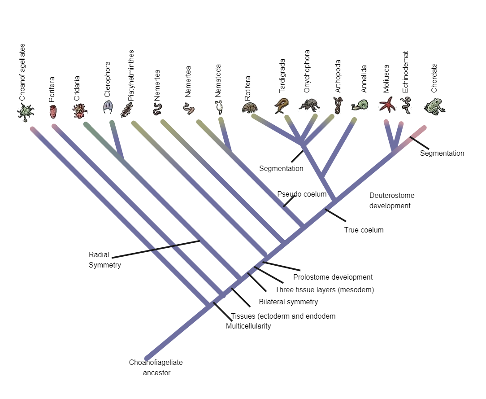

**Tại sao phải nghiên cứu?**

- Giúp phân loại và định danh loài.
- Truy nguồn gốc và con đường lây lan của mầm bệnh (virus, vi khuẩn).
- Tìm họ hàng gần của loài cần bảo tồn, hay của cây trồng/vật nuôi.
- Suy ra chức năng cũng như lịch sử tiến hóa của gen và tính trạng.

---

## 2. Cấu trúc của một cây phát sinh chủng loại

Cây phát sinh chủng loại là sơ đồ phân nhánh biểu diễn giả thuyết về quan hệ
tiến hóa giữa các taxa, dựa trên bằng chứng di truyền hoặc hình thái. Các
thành phần chính:

- **Đầu mút (tip)** — đại diện cho một taxon/loài hiện tại, ở đầu tận cùng
  của nhánh.
- **Nút (node)** — tổ tiên chung giả định, là điểm phân nhánh của hai dòng
  dõi.
- **Nhánh (branch)** — dòng tiến hóa; độ dài nhánh có thể biểu thị mức thay
  đổi di truyền.
- **Gốc (root)** — tổ tiên chung của tất cả taxa; xác định chiều thời gian
  tiến hóa.
- **Nhánh đơn ngành (clade)** — một tổ tiên và toàn bộ hậu duệ của nó.

---

## 3. Cây dựa trên hình thái

Trước khi có dữ liệu phân tử, các cây phát sinh chủng loại được xây dựng
chủ yếu từ đặc điểm hình thái.

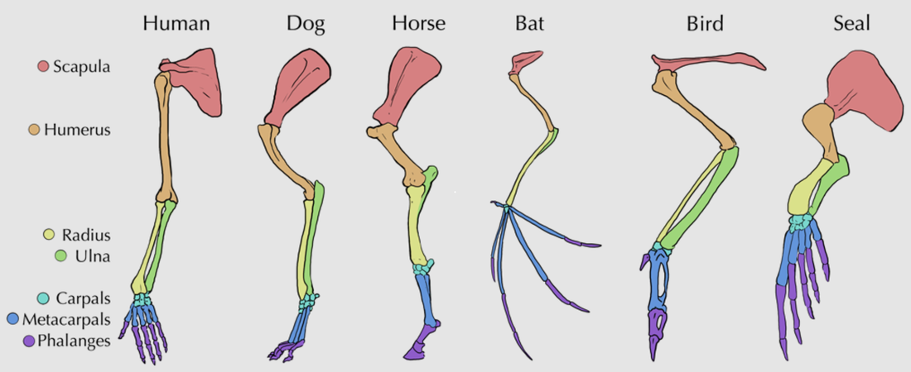

**Nguyên tắc:** những sinh vật chia sẻ nhiều đặc điểm giống nhau thì có xu
hướng có quan hệ họ hàng gần, cùng thừa hưởng các đặc điểm đó từ một tổ
tiên chung. Cách tiếp cận này đã đặt nền móng cho phân loại học và vẫn giữ
vai trò quan trọng đến nay, đặc biệt với các nhóm hóa thạch không còn DNA
để phân tích.

!!! warning "Điểm yếu"
    Không phải mọi sự giống nhau đều phản ánh nguồn gốc chung. Hai loài có
    thể trông giống nhau do tiến hóa độc lập chứ không phải do thừa hưởng
    từ tổ tiên.

Cánh của chim và dơi tiến hóa độc lập; cá mập và cá heo có hình dạng giống
nhau do thích ứng để sống dưới nước chứ không phải do cùng tổ tiên. Đây là
ví dụ kinh điển của **đồng hình — homoplasy**.

---

## 4. Tương đồng (homology) và Đồng hình (homoplasy)

| | Tương đồng — Homology | Đồng hình — Homoplasy |
|---|---|---|
| Bản chất | Tín hiệu thật | Nhiễu tín hiệu |
| Định nghĩa | Sự giống nhau do **cùng nguồn gốc** tổ tiên — đây là tín hiệu tiến hóa thực sự mà chúng ta muốn dùng để dựng cây. | Sự giống nhau **không** do chung tổ tiên: tiến hóa hội tụ, đảo ngược, song song. Trông giống tương đồng nhưng gây hiểu sai về quan hệ. |

**Vì sao cần phát triển thêm các phương pháp suy luận?** Mắt thường không
phân biệt được tương đồng với đồng hình. Cần mô hình thống kê rõ ràng
(khoảng cách, parsimony, likelihood, Bayes) để tách tín hiệu tiến hóa thật
khỏi tín hiệu nhiễu và để lượng hóa mức độ tin cậy.

---

## 5. Phát sinh chủng loại phân tử

**Ý tưởng nền tảng:** ở cấp độ phân tử, tiến hóa là quá trình tích lũy và
chọn lọc các đột biến theo thời gian. Vì vậy, mức khác biệt về trình tự
giữa hai loài phản ánh khoảng cách tiến hóa giữa chúng.

**Phát sinh chủng loại phân tử (molecular phylogenetics)** là một nhánh của
phát sinh chủng loại học, phân tích sự khác biệt di truyền phân tử — chủ
yếu trên các trình tự DNA — để có được thông tin về quan hệ tiến hóa của
sinh vật.

### Lịch sử phát triển

**Giai đoạn 1960s–1990s**

- **1965** — Zuckerkandl & Pauling: sử dụng trình tự protein để xây dựng
  cây và đề xuất ý tưởng đồng hồ phân tử (molecular clock).
- **1977** — công nghệ giải trình tự Sanger ra đời.
- **1980s** — Camin & Sokal: phương pháp Maximum Parsimony.
- **1983** — Mullis phát minh PCR.
- **1987** — Saitou & Nei: phương pháp Neighbor-Joining.
- **1990** — Woese, Kandler & Wheelis: hệ thống ba vực (Bacteria, Archaea,
  Eukarya); Woese & Fox trước đó (1977) đã dùng trình tự rRNA 16S để phát
  hiện vực Archaea.
- Felsenstein: phương pháp Maximum Likelihood và bootstrap.

**Giai đoạn 1997–2020**

- **1997** — thuật ngữ "Phylogenomics" ra đời.
- **2001** — Huelsenbeck & Ronquist: phần mềm MrBayes.
- **2003** — Rannala & Yang, Mau & Newton: đặt nền cho suy luận Bayes trong
  phát sinh chủng loại bằng MCMC.
- **>2005** — công nghệ giải trình tự thế hệ mới (NGS).
- **2015** — Nguyen et al.: phần mềm IQ-TREE.
- **2016** — Hug et al.: cây sự sống quy mô hệ gen.
- **2020** — COVID-19: dịch tễ học hệ gen phát sinh chủng loại trở thành
  công cụ theo dõi đại dịch trước công chúng.

### Ưu điểm của phát sinh chủng loại phân tử

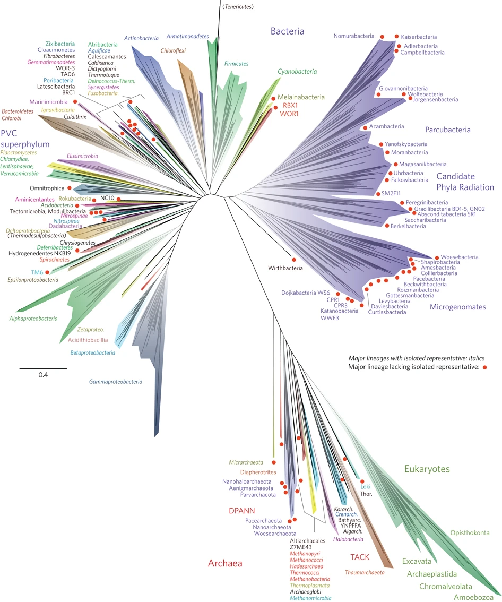

- Lượng thông tin lớn và khách quan (định lượng được).
- Áp dụng cho mọi nhóm sinh vật, kể cả vi sinh vật không có nhiều đặc điểm
  hình thái.
- Giải quyết được nhiều quan hệ mà chỉ hình thái không phân biệt được.

*Nguồn hình: Hug et al., 2016.*

---

## 6. Từ DNA đến trình tự dùng để dựng cây

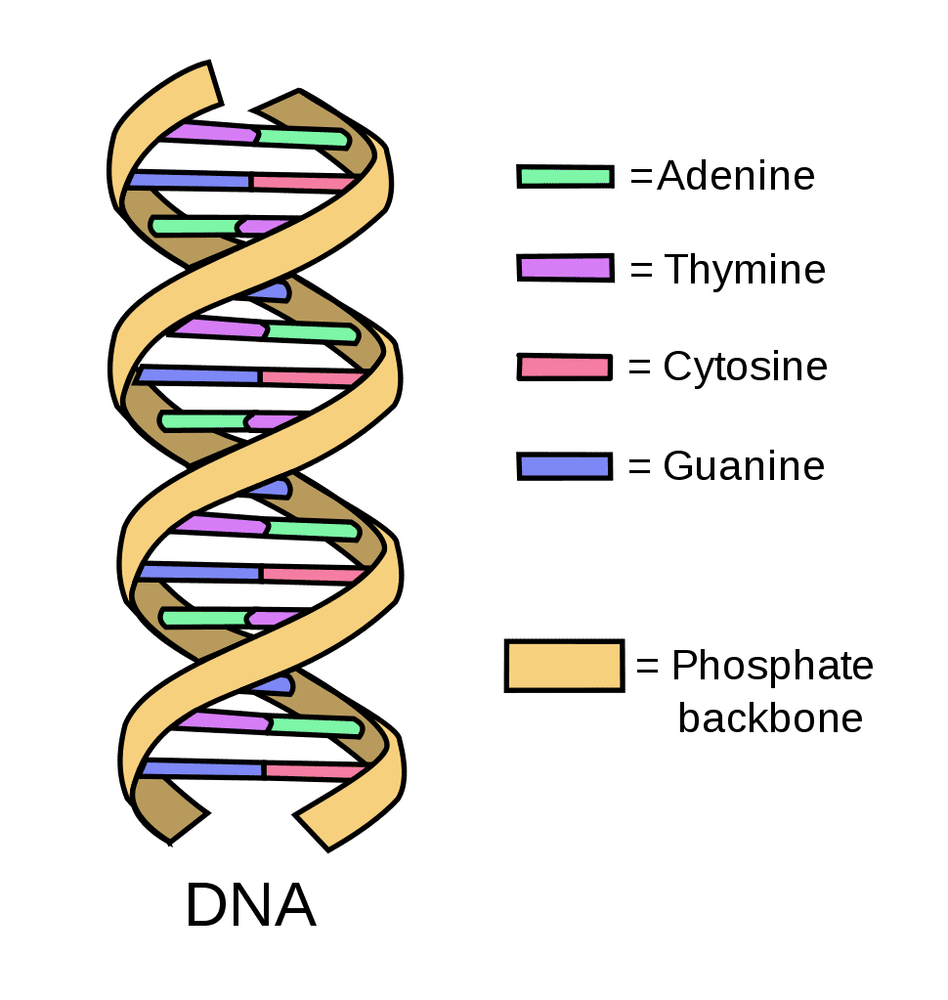

**DNA** là phân tử mang thông tin di truyền, gồm các nucleotide được cấu
tạo từ một trong 4 loại nucleobase chứa nitrogen: Cytosine (C), Guanine
(G), Adenine (A), Thymine (T) / Uracil (U). **Gen** là một trình tự
DNA/RNA của hệ gen cần thiết cho một chức năng nhất định, gồm 3 loại chính:

- Gen mã hóa protein — được phiên mã sang RNA rồi dịch mã sang protein.
- Các gen RNA đặc hiệu — chỉ phiên mã (mRNA, tRNA).
- Các gen không phiên mã.

### Vì sao thường chọn DNA thay vì protein?

Vì amino acid có thể chứa các thay đổi đồng nghĩa (nhiều codon cùng mã hóa
một amino acid), nên trình tự protein chứa ít thông tin phát sinh chủng
loại hơn trình tự DNA tương ứng. Do vậy DNA thường được ưu tiên để xây
dựng cây phát sinh chủng loại.

### Nên chọn trình tự DNA nào?

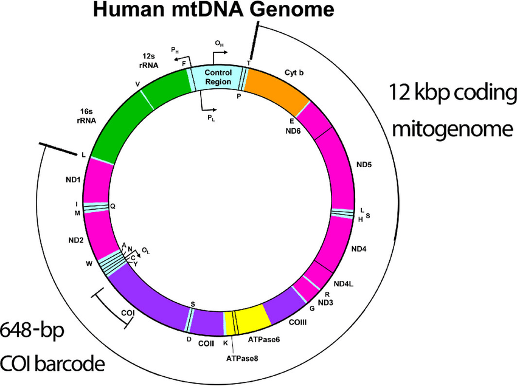

Thường sử dụng **DNA ty thể** để phân tích phát sinh chủng loại vì:

- Kế thừa theo dòng mẹ → luôn có và không bị đứt quãng.
- Tỉ lệ tái tổ hợp thấp → tránh bị nhiễu tín hiệu bởi tái tổ hợp.
- Tốc độ tiến hóa nhanh → cho phép phát hiện thay đổi di truyền kể cả với
  các nhóm có quan hệ gần gũi.
- Dễ sử dụng: đã có sẵn các mồi được thiết kế trước đó để khuếch đại các
  đoạn DNA.

Nên xem tài liệu và các nghiên cứu trước để xác định gen phân tích. Một số
gen thường dùng: **16S, COI, Cytb, ND2**.

---

## 7. Quy trình tổng quát của một nghiên cứu phát sinh chủng loại phân tử

1. Kiểm tra chất lượng; thu thập dữ liệu
2. Giải trình tự
3. Căn chỉnh / gióng hàng
4. Chọn mô hình
5. Suy luận
6. Hỗ trợ nhánh
7. Diễn giải

!!! note "Vì sao thứ tự này quan trọng"
    Sai sót ở bước đầu (chất lượng, căn chỉnh) sẽ lan sang toàn bộ kết quả
    về sau — vì vậy chuẩn bị và làm sạch dữ liệu quan trọng không kém việc
    chọn phương pháp suy luận.

### Phần mềm sử dụng trong hội thảo

- **ChromasPro** (Bước 1–2) — kiểm tra chất lượng & lắp ráp chromatogram
  Sanger (`.ab1`) thành trình tự đồng thuận.
- **MEGA** (Bước 3–4) — căn chỉnh đa trình tự, chọn mô hình sơ bộ và dựng
  cây thăm dò (NJ/ML).
- **IQ-TREE** (Bước 4–6) — ModelFinder + suy luận Maximum Likelihood nhanh,
  chặt chẽ, kèm ultrafast bootstrap.
- **MrBayes** (Bước 5–6) — suy luận Bayes bằng MCMC; cho cây hậu nghiệm và
  xác suất hậu nghiệm.

---

## 8. Bốn phương pháp suy luận cây

### Phương pháp Khoảng cách (Distance-based)

Chuyển các trình tự đã căn chỉnh thành một ma trận khoảng cách di truyền
giữa từng cặp taxa, rồi dựng cây từ ma trận đó (ví dụ Neighbor-Joining,
UPGMA).

- **Ưu điểm:** rất nhanh, trực quan, phù hợp cho bộ dữ liệu lớn hoặc khảo
  sát ban đầu.
- **Hạn chế:** gộp thông tin từng vị trí thành một con số duy nhất → mất
  chi tiết; kết quả phụ thuộc cách tính khoảng cách.
- **Công cụ:** MEGA — dùng ở bước thăm dò (Neighbor-Joining / UPGMA).

### Phương pháp Tiết kiệm nhất (Maximum Parsimony)

Chọn cây yêu cầu số lần thay đổi tiến hóa ít nhất để giải thích dữ liệu —
theo nguyên tắc "giả thuyết đơn giản nhất".

- **Ưu điểm:** trực giác, không cần mô hình thống kê phức tạp; dễ giải
  thích cho người mới.
- **Hạn chế:** dễ sai khi tốc độ tiến hóa không đều giữa các nhánh (hiện
  tượng "hút nhánh dài" — long-branch attraction).
- **Công cụ:** MEGA (tùy chọn Maximum Parsimony); PAUP*.

### Hợp lý cực đại (Maximum Likelihood — ML)

Tìm cây *và* mô hình thay thế làm cực đại xác suất quan sát được dữ liệu
trình tự (likelihood).

- **Ưu điểm:** nền tảng thống kê chặt chẽ, dùng hết thông tin từng vị trí,
  kết quả nhất quán và có thể lặp lại.
- **Hạn chế:** tính toán lâu (IQ-TREE giải quyết một phần vấn đề này); cần
  chọn đúng mô hình thay thế; cho một cây tốt nhất chứ không phải một
  phân phối cây.
- **Công cụ:** Treefinder, RAxML, IQ-TREE (ModelFinder + ML + ultrafast
  bootstrap).

### Suy luận Bayes (Bayesian Inference — BI)

Tính xác suất **hậu nghiệm** của cây = tiên nghiệm × hợp lý, và lấy mẫu
không gian cây bằng MCMC thay vì tìm một nghiệm tối ưu duy nhất.

- **Ưu điểm:** cho cả một phân phối cây kèm xác suất hậu nghiệm; xử lý
  được mô hình phức tạp và độ bất định; cho phép thêm thông tin dựa trên
  giả thuyết của mình.
- **Hạn chế:** chạy chậm, cần kiểm tra sự hội tụ (burn-in, ESS); kết quả
  phụ thuộc lựa chọn tiên nghiệm.
- **Công cụ:** MrBayes (MCMC) — kiểm tra hội tụ bằng Tracer.

---

## 9. Đánh giá cây phát sinh: đọc cây thế nào?

Khi đọc một cây phát sinh chủng loại, hãy tự hỏi bốn câu:

1. **Giá trị hỗ trợ là gì?** Con số ở mỗi nút thể hiện độ tin cậy của nhánh
   (bootstrap % và/hoặc xác suất hậu nghiệm — PP). Cao (BS ≳ 70–95%, PP ≳
   0.95) → đáng tin; thấp → quan hệ chưa chắc chắn.
2. **Quan tâm loài nào?** Xác định loài/nhánh bạn nghiên cứu, rồi tìm họ
   hàng gần nhất (nhóm chị em — sister group) nằm cạnh nó trên cây.
3. **Nhánh quan tâm có tách biệt rõ ràng không?** Nhánh của bạn có tạo
   thành nhóm đơn ngành riêng với hỗ trợ cao, tách khỏi các loài khác — hay
   bị chen lẫn vào giữa chúng?
4. **Nhóm ngoài (outgroup) ở đâu?** Kiểm tra nhóm ngoài nằm ở gốc và tách
   biệt với nhóm trong; nó định hướng gốc cho cây và xác nhận nhóm nghiên
   cứu là đơn ngành.

*Quy ước thường gặp: số tại nút = bootstrap (%) / xác suất hậu nghiệm
(PP); màu xanh = hỗ trợ cao, màu cam = hỗ trợ thấp.*

### Bootstrap và xác suất hậu nghiệm khác nhau ở đâu?

| | Bootstrap (BS) | Posterior Probability (PP) |
|---|---|---|
| Ý nghĩa | Độ ổn định của tín hiệu | Xác suất theo mô hình Bayes |
| Cách tính | Lấy mẫu lại các vị trí (có hoàn lại) và dựng lại cây nhiều lần. BS% = tỉ lệ số lần một nhánh xuất hiện → đo mức độ ổn định của tín hiệu trong dữ liệu. | Xác suất một nhánh là đúng, tính từ phân phối hậu nghiệm với mô hình và dữ liệu đã cho. Nhận giá trị 0–1. |

!!! warning "Những cách hiểu sai thường gặp"
    - BS **không phải** là "% xác suất nhánh đúng" — nó chỉ đo độ lặp lại
      của tín hiệu.
    - BS thường cần tối thiểu 70% để đáng tin cậy; ultrafast bootstrap
      (UFB) hoặc PP thì cần từ 95%.
    - Giá trị hỗ trợ cao vẫn có thể **sai** nếu mô hình sai hoặc dữ liệu bị
      lệch.

---

## 10. Một số cây phát sinh chủng loại từ các loài mới được mô tả

Các ví dụ dưới đây là các loài mới công bố gần đây, minh họa cách gen
được chọn (COI, 16S, Cytb, ND2, hay tổ hợp nhiều gen) tùy vào nhóm sinh
vật và câu hỏi nghiên cứu.

| Loài mới | Nguồn công bố | Gen sử dụng |
|---|---|---|
| *Acanthosaura grismeri* (Le et al., 2025) | Zootaxa | COI |
| *Zhangixalus thaoae* (Nguyen et al., 2024) | ZooKeys | 16S |
| *Euroscaptor darwini* (Vu et al., 2025) | ZooKeys | Cytb & 12S |
| *Uropsilus fansipanensis* (Bui et al., 2023) | Zootaxa | Cytb, RAG1, RAG2 |
| *Tylototriton vietnamirabilis* (Ong et al., 2026) | ZooKeys | ND2 |

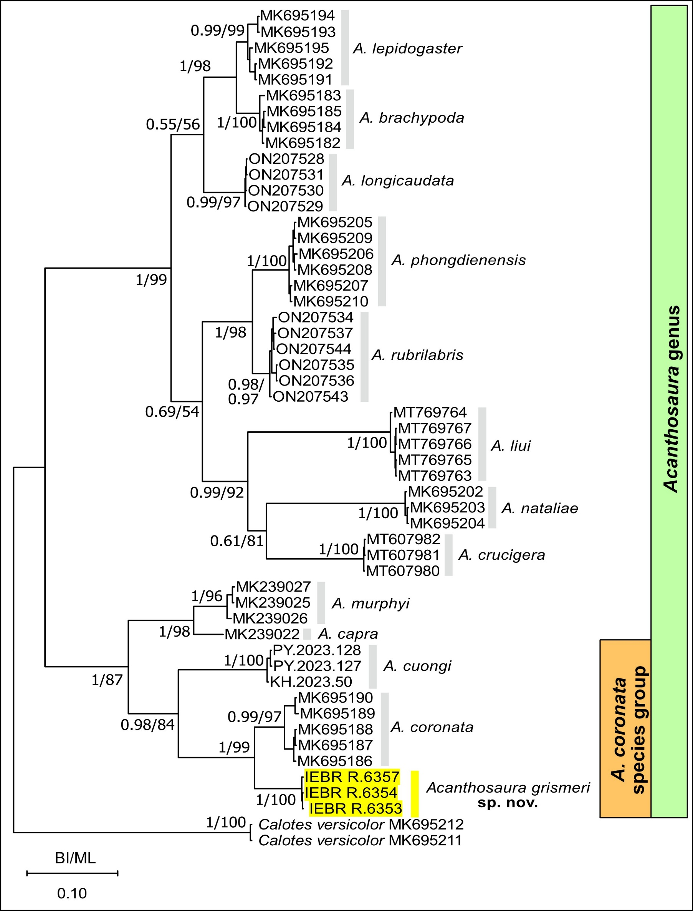
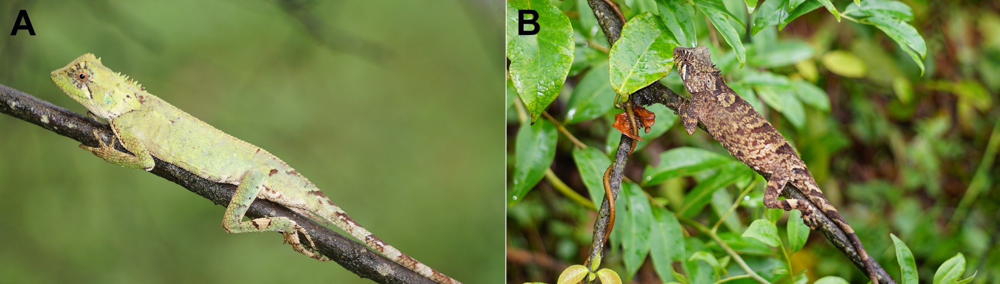

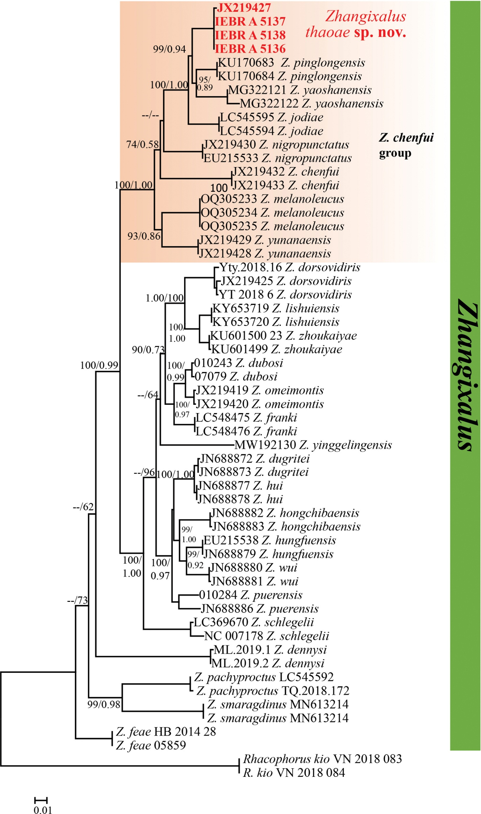
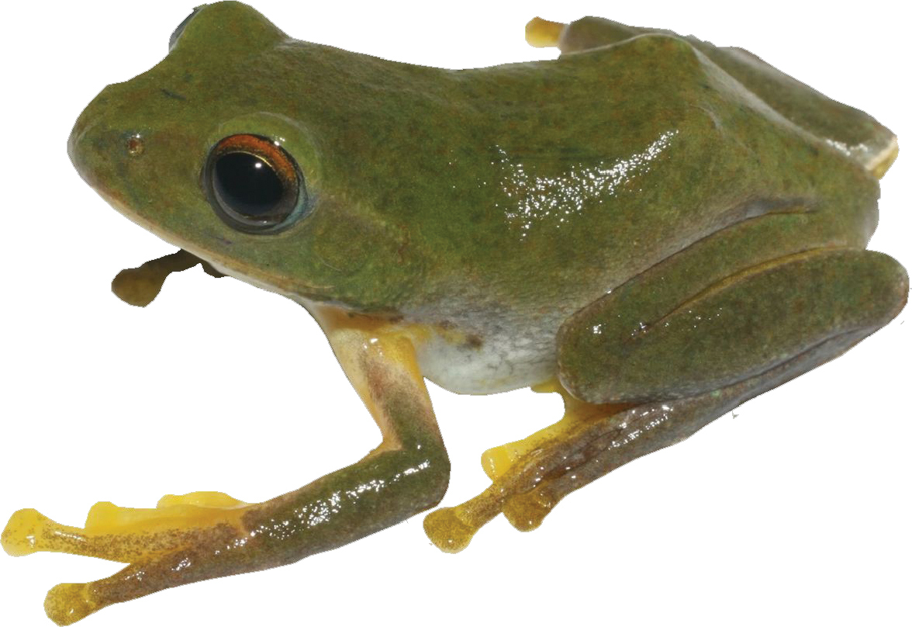

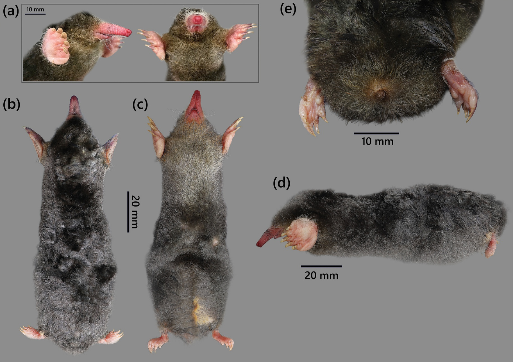
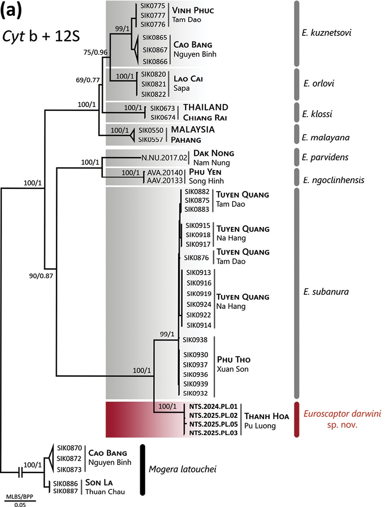

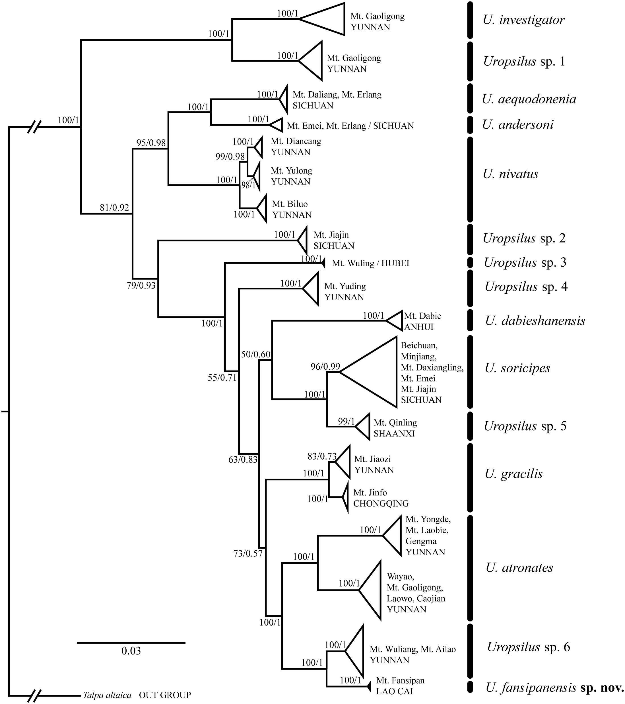
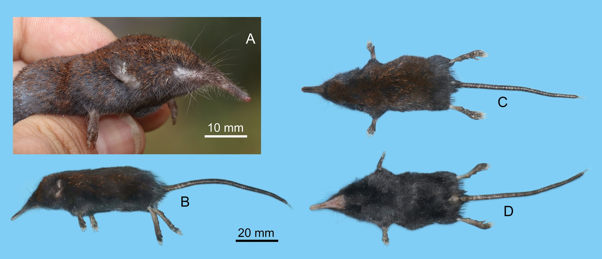

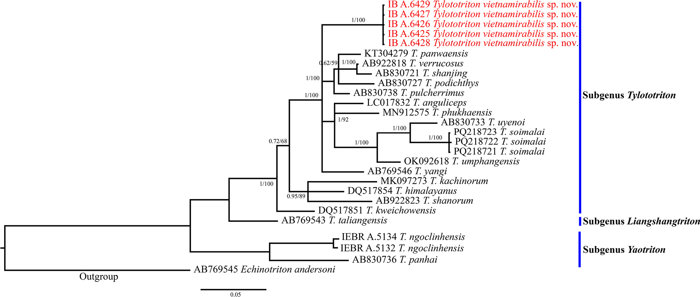
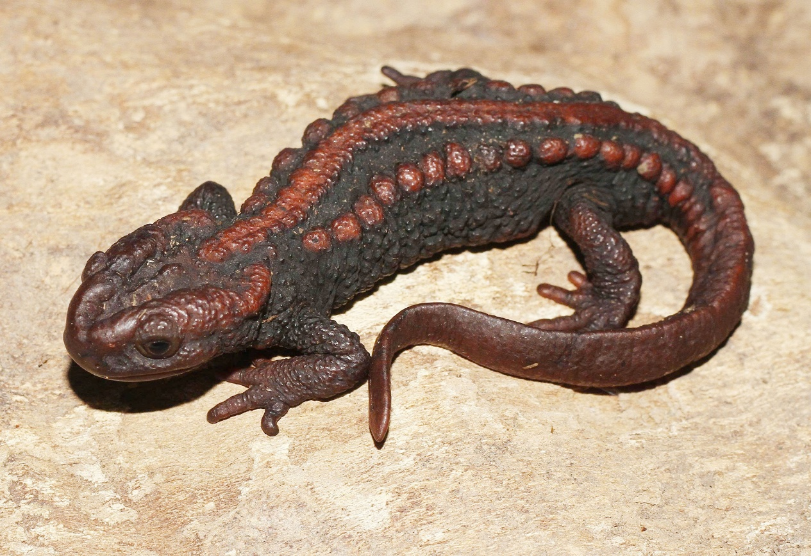

---

## Tiếp theo

Phần 2 sẽ đi vào thực hành: đọc và lắp ráp chromatogram bằng ChromasPro,
định danh trình tự bằng BLAST, thu thập trình tự tham chiếu từ GenBank, và
căn chỉnh bằng MEGA.
