# Phần 2 — Đọc, thu thập và căn chỉnh trình tự

**ChromasPro · BLAST · GenBank · MEGA**

**Trình bày:** Lê Từ Hoàng Linh & Ninh Thị Hòa

Nội dung của phần này: kiểm tra chất lượng & lắp ráp trình tự, định danh
bằng BLAST, thu thập trình tự tham chiếu từ GenBank, và căn chỉnh bằng
MEGA — tạo ra bộ dữ liệu sẵn sàng cho việc dựng cây. Đây là bước 1–4 trong
quy trình tổng quát đã giới thiệu ở Phần 1 (kiểm tra chất lượng → giải
trình tự → căn chỉnh → chọn mô hình).

---

## I. ChromasPro — Đọc & lắp ráp chromatogram

*Từ file thô `.ab1` đến trình tự đồng thuận (consensus) sạch dạng FASTA.*

### Trình tự Sanger ra đời như thế nào

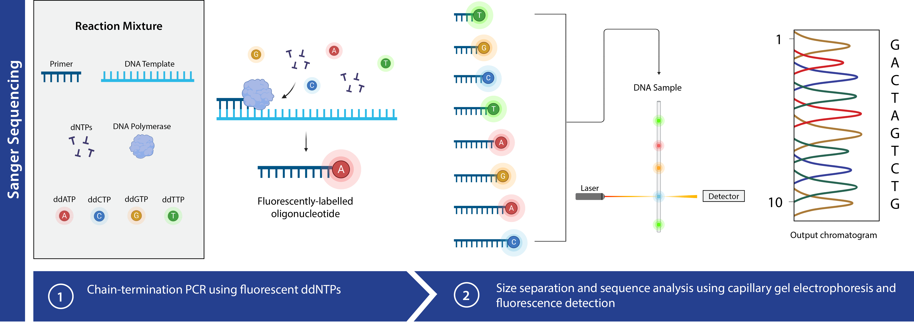

- **Nguyên lý:** phương pháp dideoxy làm dừng chuỗi DNA một cách ngẫu
  nhiên tại từng base.
- **Đọc tín hiệu:** máy phát hiện 4 màu huỳnh quang tương ứng A, T, G, C.
- **Kết quả thô:** một **chromatogram** — biểu đồ các đỉnh tín hiệu theo
  vị trí.

### File `.ab1` và chromatogram là gì

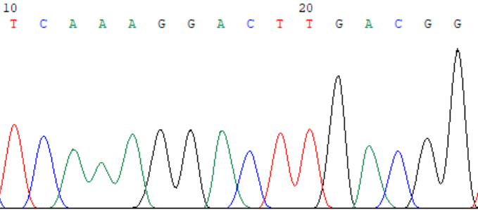

`.ab1` (hoặc `.scf`) là file thô từ máy giải trình tự Sanger, chứa dấu vết
huỳnh quang (trace), base máy gọi, và điểm chất lượng của từng base.
Chromatogram là biểu đồ 4 màu đỉnh tín hiệu dọc theo trình tự — mỗi màu
một base (A, C, G, T; quy ước màu tùy phần mềm).

### Cách đọc một chromatogram

<div class="grid" markdown>
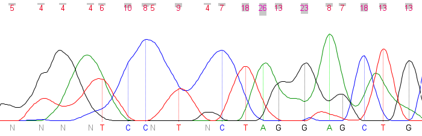
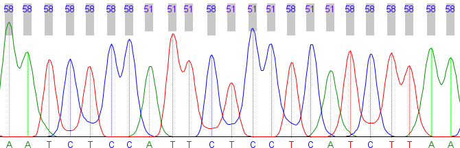
</div>

- **Tín hiệu tốt:** đỉnh cao, nhọn, tách biệt rõ ràng.
- **Tín hiệu kém:** đỉnh thấp, chồng lấn, nhiễu nền.
- **Base "N":** máy không xác định được — cần xem lại bằng mắt.

!!! note "Nguyên tắc"
    Chỉ tin base khi trace tại vị trí đó rõ ràng.

### Điểm chất lượng (Quality Value / Phred)

Công thức: **QV = −10 · log₁₀(xác suất gọi sai)**. QV càng cao, base càng
đáng tin. ChromasPro hiển thị QV ở mỗi base — dùng làm căn cứ để cắt tỉa
và quyết định base tại vị trí đó là gì.

| Ngưỡng | Xác suất sai | Diễn giải |
|---|---|---|
| Q20 | 1% | 1 base sai trên 100 |
| Q30 | 0,1% | 1 base sai trên 1000 |

### Giới thiệu ChromasPro

<div class="grid" markdown>
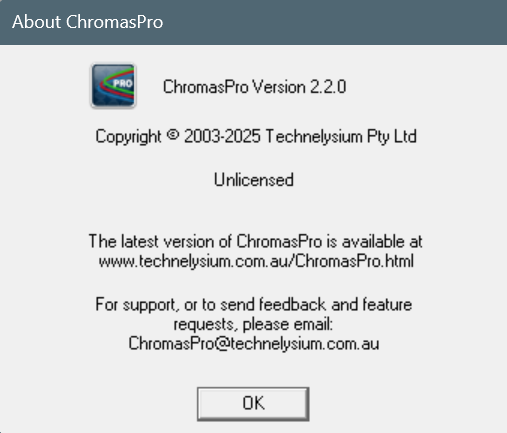
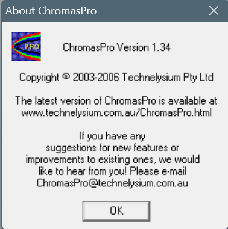
</div>

- **Vai trò:** xem, kiểm tra chất lượng, cắt tỉa và lắp ráp các read Sanger
  thành contig, rồi xuất consensus.
- **Phiên bản mới nhất:** 2.x; chạy gốc trên Windows.
- **Nguồn tải:** technelysium.com.au (Technelysium).
- **Đầu ra:** trình tự đồng thuận sạch dạng FASTA.

### Cắt tỉa và giữ đoạn đọc chất lượng tốt

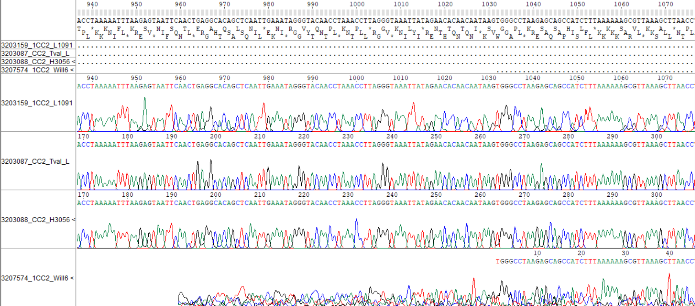

Hai đầu read thường có chất lượng thấp (nhiễu, nhiều N). Cắt vùng QV thấp
— tự động theo ngưỡng (ví dụ Q20) hoặc thủ công — để chỉ giữ lại vùng lõi
tin cậy.

### Lắp ráp contig, consensus & xuất FASTA

```
Forward  →                      >Loai_A_Mau01
                                 ATGCTAGCTAGCTTAGGCTAACGT
←  Reverse (reverse-complement)  TAGCCGATCGTAGCTAGGCTA...

↓  lắp ráp thành contig
CONTIG → CONSENSUS
```

- **Sửa base:** chỉnh "N"/base gọi nhầm khi trace rõ ràng.
- **Read ngược:** có thể cần reverse-complement trước khi ghép.
- **Lắp ráp:** căn read xuôi + ngược thành contig, bù trừ lỗi hai đầu.
- **Xung đột:** nơi hai read bất đồng → xem trace để chọn base đúng.
- **Consensus → FASTA:** xuất trình tự đồng thuận, đặt tên rõ ràng.

---

## II. NCBI & BLAST — Định danh trình tự

*Xác định trình tự của bạn là loài gì bằng cách so với ngân hàng dữ liệu.*

### NCBI là gì

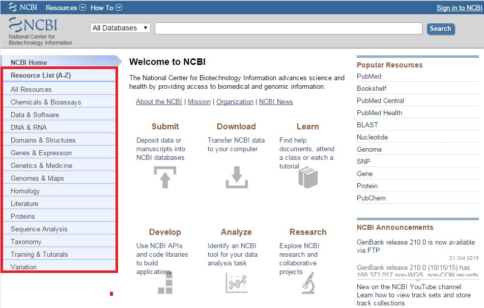

NCBI (Trung tâm Thông tin Công nghệ Sinh học Quốc gia — Hoa Kỳ) truy cập
miễn phí qua web, lưu trữ và cung cấp dữ liệu trình tự cùng các công cụ
phân tích:

- **GenBank / Nucleotide, Protein** — trình tự DNA/RNA và protein.
- **SRA** — dữ liệu giải trình tự thô.
- **PubMed** — tài liệu khoa học.
- **Taxonomy** — phân loại sinh vật.
- **BLAST** — tìm tương đồng.

### GenBank là gì

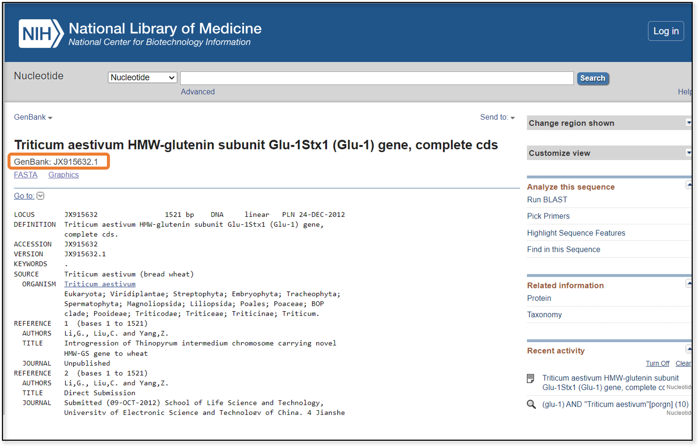

GenBank là ngân hàng trình tự DNA/RNA công khai, cập nhật liên tục. Mỗi
trình tự có một **accession number** kèm số phiên bản (ví dụ
`MN908947.3` — `MN908947` là mã accession, `.3` là phiên bản). Đây là
nguồn chính để lấy trình tự tham chiếu khi xây dựng bộ dữ liệu.

### BLAST: vì sao cần & nguyên lý

Sau khi có consensus, câu hỏi đặt ra là: "trình tự này là loài gì?"
**BLAST** (Basic Local Alignment Search Tool,
[blast.ncbi.nlm.nih.gov](https://blast.ncbi.nlm.nih.gov/Blast.cgi)) so
trình tự với hàng triệu trình tự trong cơ sở dữ liệu, tìm các đoạn căn
chỉnh cục bộ giống nhau — nhanh nhờ thuật toán heuristic — và trả về danh
sách hits xếp theo mức tương đồng.

## Thao tác chạy BLAST trên web

*Đường link đến NCBI BLAST*: [blast.ncbi.nlm.nih.gov](https://blast.ncbi.nlm.nih.gov/Blast.cgi)

### Các loại chương trình BLAST
<div class="grid" markdown>
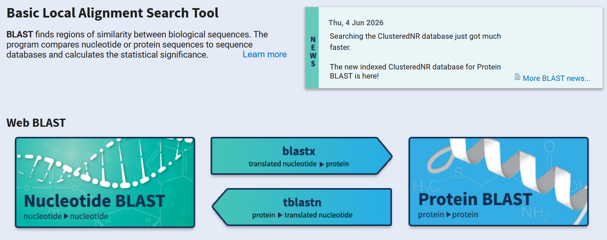

| Chương trình | Query | Database |
|---|---|---|
| `blastn` | DNA | DNA |
| `blastp` | Protein | Protein |
| `blastx` | DNA (dịch mã) | Protein |
| `tblastn` | Protein | DNA (dịch mã) |
| `tblastx` | DNA (dịch mã) | DNA (dịch mã) |

</div>
!!! tip "Mẹo"
    Với trình tự DNA để định danh: dùng **blastn**.

### Cách chạy BLAST Nucleotide

<div class="grid" markdown>

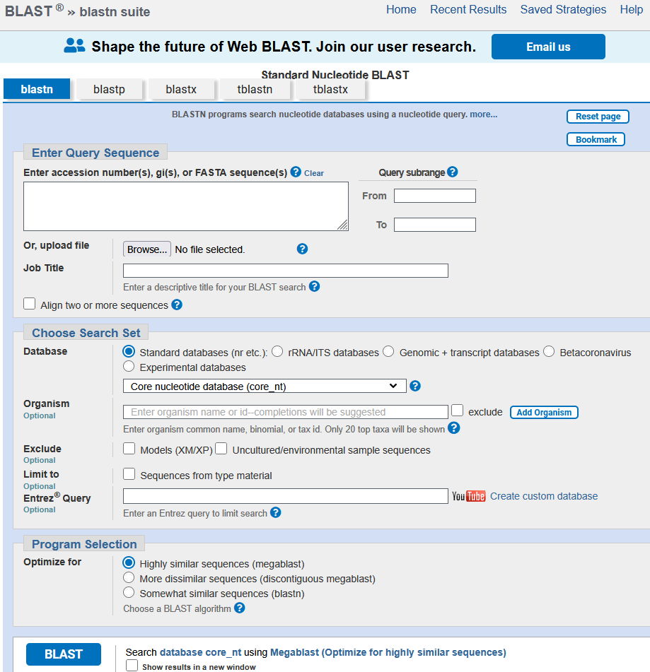

1. Vào NCBI BLAST → Nucleotide BLAST.
2. Dán FASTA hoặc upload file trình tự.
3. Chọn database.
4. Chọn Organism nếu đã biết/nghi ngờ loài (thu hẹp tìm kiếm).
5. Chọn program (megablast).
6. Nhấn BLAST — chờ kết quả.

</div>

### Đọc kết quả BLAST

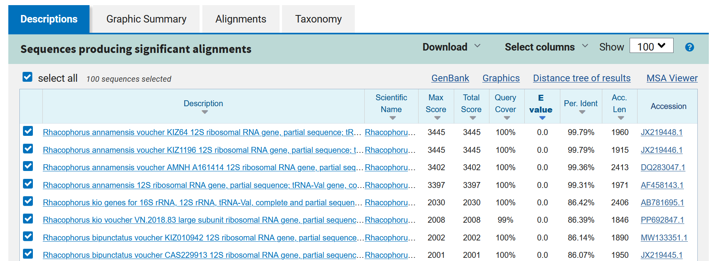

- **Graphic Summary** — đồ thị phân bố các hits theo query.
- **Descriptions** — bảng danh sách hits, nơi ra quyết định.
- **Alignments** — chi tiết căn chỉnh từng hit.

**Các chỉ số quan trọng:**

- **Percent Identity** — tỉ lệ base giống nhau trong vùng căn chỉnh. Định
  danh loài thường muốn ≳ 97–99%.
- **Query Cover** — phần trăm chiều dài query được căn chỉnh. Thấp = chỉ
  khớp một đoạn ngắn.
- **E-value** — số hits ngẫu nhiên kỳ vọng có điểm tương đương. Càng nhỏ
  (≈ 0) càng đáng tin.
- **Bit / Max score** — điểm căn chỉnh đã chuẩn hóa. Càng cao càng mạnh;
  dùng để so sánh các hits.

!!! tip
    Đọc **tất cả** các chỉ số cùng nhau — không nên dựa vào một con số
    duy nhất.

### Diễn giải kết quả & cảnh báo

Định danh dựa vào hit tốt nhất + độ phủ cao + nhiều hits nhất quán. Nhiều
hits cùng loài củng cố độ tin cậy; nếu các hit tốt thuộc nhiều loài khác
nhau, cần thận trọng và tìm thêm bằng chứng.

!!! warning "Lưu ý"
    - Trình tự trên GenBank có thể bị định danh sai hoặc nhiễm.
    - Nhiều trình tự trên GenBank không được cập nhật thông tin theo bài
      báo, nên cần tra cứu và tìm hiểu thêm trước khi sử dụng.
    - Ưu tiên trình tự từ bài báo bình duyệt và mẫu chuẩn (type/voucher).
    - Một số trình tự có thể bao gồm nhiều gen, thậm chí cả hệ gen → chỉ
      lấy đoạn gen mình cần.

---

## III. GenBank — Thu thập trình tự

*Xây dựng bộ dữ liệu tham chiếu cho phân tích phát sinh chủng loại.*

### Chiến lược xây dựng bộ dữ liệu

- **Nhóm nghiên cứu (ingroup):** các taxa cần tìm hiểu quan hệ
  (thường 12–16 taxa).
- **Nhóm ngoài (outgroup):** 1–2 taxa để đặt gốc cho cây.
- **Cùng marker:** các trình tự cần trong cùng một gen/vùng (ví dụ COI) để có thể so sánh được.
- **Số lượng:** vừa đủ để chạy nhanh nhưng vẫn thể hiện biến thiên.

!!! tip "Mẹo"
    Thay vì tự chọn trình tự, bạn có thể tham khảo các bài báo khác để lấy
    bảng trình tự mà họ đã dùng để xây cây phát sinh chủng loại, làm nền
    tảng cho bộ dữ liệu của mình.

### Tìm kiếm trên NCBI Nucleotide

- Chọn cở sở dữ liệu Nucleotide
- Kết hợp trường Organism và Gene, ví dụ:

```
Acanthosaura[Organism] AND COI[Gene]
```


<br>

Lọc kết quả bằng bộ lọc (Sort by) theo:

- Độ dài (Sequence length)
- Mã Genbank (Accession)
- Ngày đăng (Date Released)

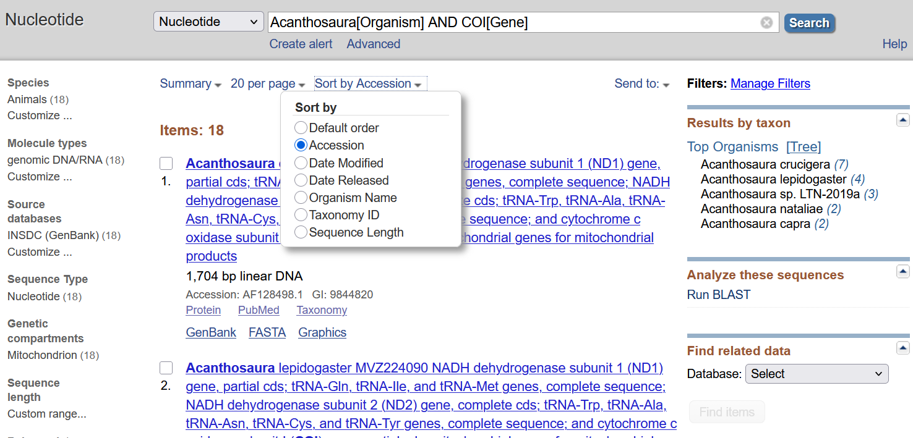

### Đọc một bản ghi GenBank

<div class="grid" markdown>

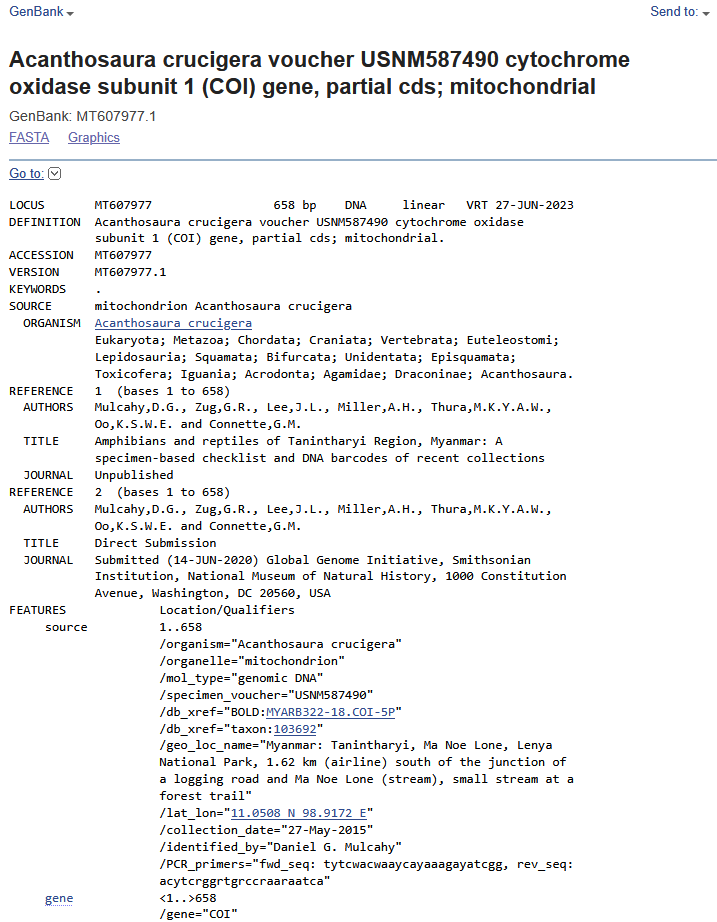

| Trường | Nội dung |
|---|---|
| `LOCUS` | tên/mã genbank, độ dài, loại phân tử |
| `DEFINITION` | mô tả trình tự |
| `ACCESSION` / `VERSION` | mã định danh + phiên bản |
| `SOURCE` | nguồn mẫu |
| `ORGANISM` | loài sinh vật |
| `AUTHORS` | tác giả |
| `TITLE` | tên bài báo |
| `JOURNAL` | tên tạp chí |
| `FEATURES` | thành phần trình tự: gene, CDS, product |

</div>

**Cần kiểm tra:** đúng gen/vùng mình cần (xem FEATURES); loài trong
ORGANISM khớp kỳ vọng; độ dài hợp lý, không phải mảnh quá ngắn.

### Cách chọn trình tự tham chiếu và thông tin ghi lại

- Ứng viên từ BLAST: các hit tốt chính là trình tự nên đưa vào bộ dữ liệu.
- Bổ sung từ bài báo: lấy thêm trình tự từ các nghiên cứu đã công bố về nhóm.
- Chọn đại diện: mỗi loài chọn một vài trình tự tốt, tránh dư thừa.
- Ghi nguồn: lưu accession của từng trình tự để tra cứu, trích dẫn.
- Ghi thông tin bổ trợ: địa điểm thu, tọa độ thu, độ cao, mã mẫu thực địa
 hữu ích cho các phân tích khác về sau. Nên lưu các thông tin này ra Excel.

!!! info "Bộ dữ liệu trình tự tham khảo sử dụng trong nghiên cứu"
    Tải file Excel trong bài báo sau để sử dụng tham khảo: 
    [Bài báo Rhacophorus](https://doi.org/10.3897/zookeys.1117.85787){:target="_blank"}

### Tải trình tự đơn lẻ

1. Mở bản ghi trình tự cần tải.
2. `Send to` → `File`.
3. Chọn định dạng FASTA (hoặc GenBank `.gb`).
4. Lưu file về máy.

Phù hợp khi chỉ cần vài trình tự.

### Batch Entrez: tải hàng loạt từ danh sách accession

Khi cần nhiều trình tự cùng lúc (cả bộ dữ liệu):

1. Chuẩn bị một file văn bản, mỗi dòng một mã accession
   (`accessions.txt`).
2. Vào [Batch Entrez](https://ncbi.nlm.nih.gov/sites/batchentrez) →
   database Nucleotide → Retrieve.
3. `Send to` → `File` → FASTA cho tất cả cùng lúc.

Ưu điểm: tái tạo đúng bộ dữ liệu từ danh sách accession trong bài báo.

Danh sách trình tự
```
MN613221
MH087073
MH087076
JQ288090
JQ288091
EU215532
LC548742
EF564578
EF564577
EF646366
EU215531
AB781693
AB781694
AB728191
KY886335
KY886328
JX219442
JX219441
ON217794
ON217795
ON217796
ON217797
ON217798
```

!!! tip "Mẹo"
    Có thể dán trực tiếp danh sách accession vào ô tìm kiếm Nucleotide;
    nâng cao hơn, dùng EDirect `efetch` trên dòng lệnh.

### Quản lý, đặt tên & kiểm tra bộ dữ liệu

Ví dụ nhãn taxon rõ ràng, kèm accession:

```
>Acanthosaura_grismeri_IEBR_R_6353_PV646694
```

(Loài + mã mẫu + accession → nhãn rõ ràng, không dấu, tránh khoảng trắng
và ký tự đặc biệt để tương thích với IQ-TREE & MrBayes.)

**Danh sách kiểm tra chất lượng bộ dữ liệu:**

- [x] Cùng một vùng gen.
- [x] Độ dài tương đương.
- [x] Không trình tự quá ngắn/lỗi.
- [x] Không trùng lặp.
- [x] Có đủ nhóm ngoài (outgroup).
- [x] Loại trình tự đáng ngờ trước khi căn chỉnh.

---

## IV. MEGA — Căn chỉnh & phân tích thăm dò

*Tạo bản căn chỉnh, xem khoảng cách di truyền và cây thăm dò.*

### Giới thiệu MEGA

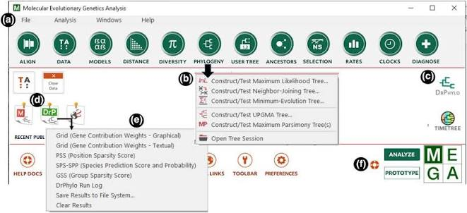

- **Là gì:** MEGA12 — công cụ căn chỉnh, kiểm định mô hình và dựng cây.
- **Ưu điểm:** giao diện thân thiện, phù hợp giảng dạy.
- **Bản quyền:** miễn phí cho nghiên cứu & giảng dạy.
- **Nền tảng:** Windows và macOS.
- **Link tải xuống:** [MEGA12](https://www.megasoftware.net/)

### Nhập dữ liệu vào MEGA

<div class="grid" markdown>
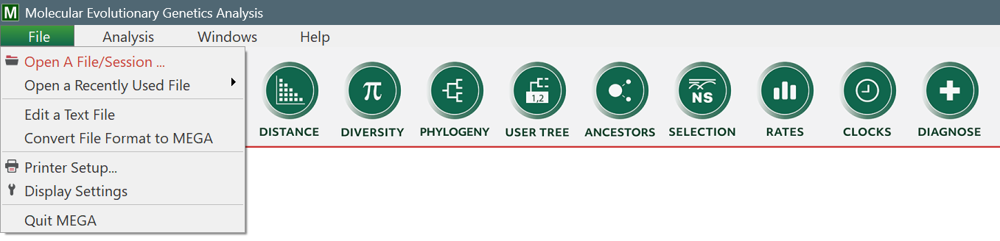
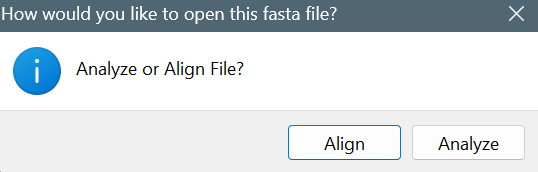
</div>

1. Mở file FASTA (consensus của bạn + trình tự GenBank).
2. Chọn `Align` → tạo Alignment Explorer.
3. Kiểm tra số lượng và nhãn trình tự.

### Căn chỉnh trình tự

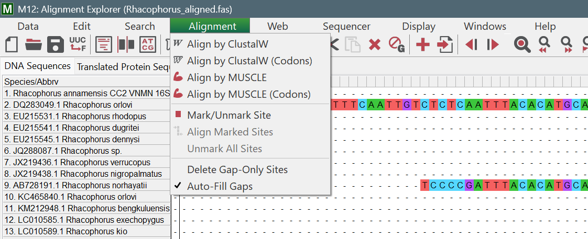

Chọn thuật toán **MUSCLE** hoặc **ClustalW** để sắp các vị trí tương đồng
thẳng cột. Khoảng trống (gap) được chèn ở nơi có thêm/mất đoạn. Alignment
tốt là điều kiện để có một cây đáng tin.

### Kiểm tra & chỉnh sửa alignment

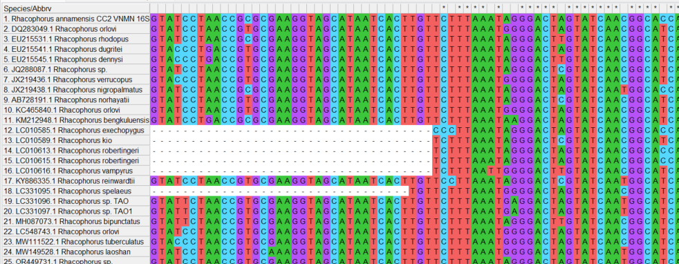

- Xem gap & vùng sai: kiểm tra bằng mắt các cột lộn xộn.
- Cắt hai đầu: bỏ phần đầu/đuôi không đồng đều giữa các trình tự.
- Gen mã hóa: dịch sang amino acid để phát hiện lỗi khung đọc (frameshift).
- Đảo chiều: DNA gồm hai chiều nên phải reverse-complement những trình tự
  bị ngược.

### Bảng khoảng cách di truyền (p-distance)

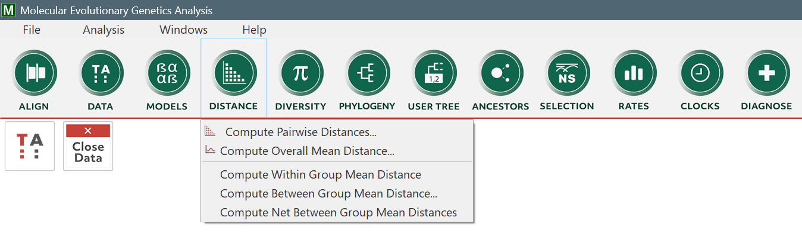

**p-distance** là tỉ lệ vị trí khác nhau giữa hai trình tự (số khác /
tổng vị trí). Trong MEGA: `Distance → Compute Pairwise Distances` → chọn
mô hình p-distance.

Công dụng: phát hiện trình tự trùng, trình tự "lạc loài" (lỗi/định danh
sai), quan sát khoảng cách giữa các loài.

!!! note
    p-distance chưa hiệu chỉnh đa lần thay thế → chỉ phù hợp cho nhóm
    quan hệ gần.

### Xây dựng cây trong MEGA

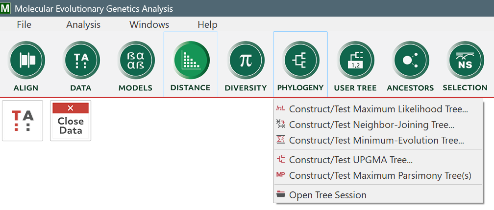

Chạy nhanh một cây **Neighbor-Joining** trong MEGA để "nhìn trước" cấu
trúc dữ liệu — đây là bước thăm dò trước khi phân tích chặt chẽ hơn bằng
IQ-TREE/MrBayes.

### Xem cây dưới dạng Newick

**Newick** là định dạng văn bản mô tả cây bằng dấu ngoặc lồng nhau: ngoặc
= nhóm/clade; dấu phẩy tách taxa; `:số` = độ dài nhánh; `;` kết thúc. Ví
dụ cây bốn taxa A, B, C, D:

```
((A,B),(C,D));
```

MEGA có thể hiển thị/xuất cây ở dạng Newick. Các file `.treefile`/`.nwk`
của IQ-TREE & MrBayes chính là định dạng Newick này.

### Lưu & xuất alignment

| Định dạng | Đuôi file | Dùng cho |
|---|---|---|
| MEGA | `.meg` / `.mas` | Lưu session trong MEGA |
| FASTA | `.fasta` / `.fas` | Phổ biến, IQ-TREE |
| NEXUS | `.nex` | MrBayes |
| PHYLIP | `.phy` | Nhiều công cụ ML |

!!! note "Lưu ý"
    Giữ một bản alignment "gốc chuẩn" làm dự phòng.

---

## Tổng kết Phần 2

```
ChromasPro (consensus contig) → BLAST (định danh) → GenBank + Batch Entrez
  → MEGA (alignment + p-distance) → Sẵn sàng dựng cây
```

Toàn bộ quy trình của Phần 2 đi từ chromatogram thô đến một bản căn chỉnh
đã được kiểm tra chất lượng. Kết quả: bộ dữ liệu sẵn sàng cho việc dựng
cây phát sinh chủng loại ở phần sau.
