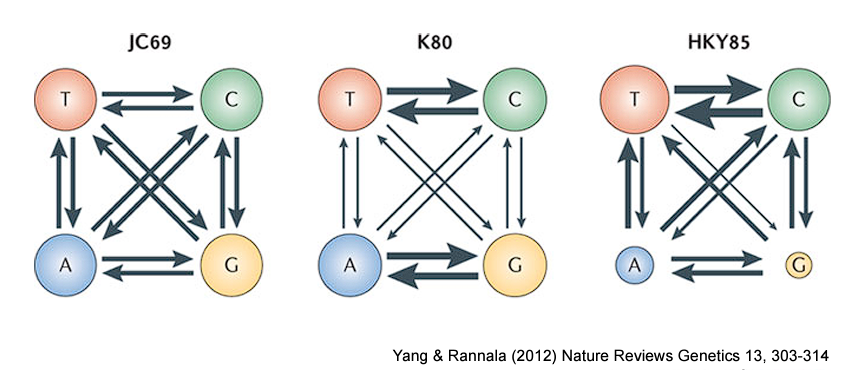
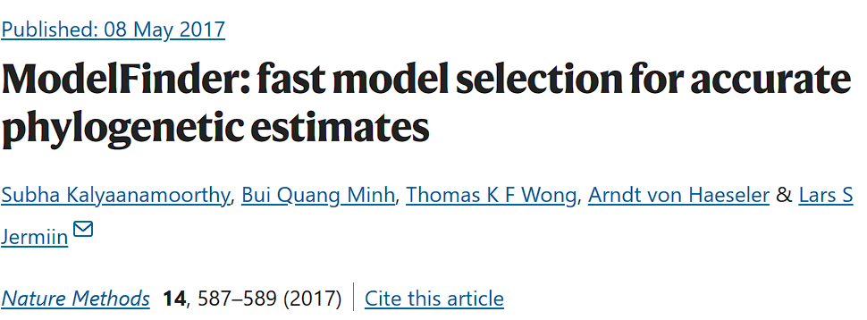
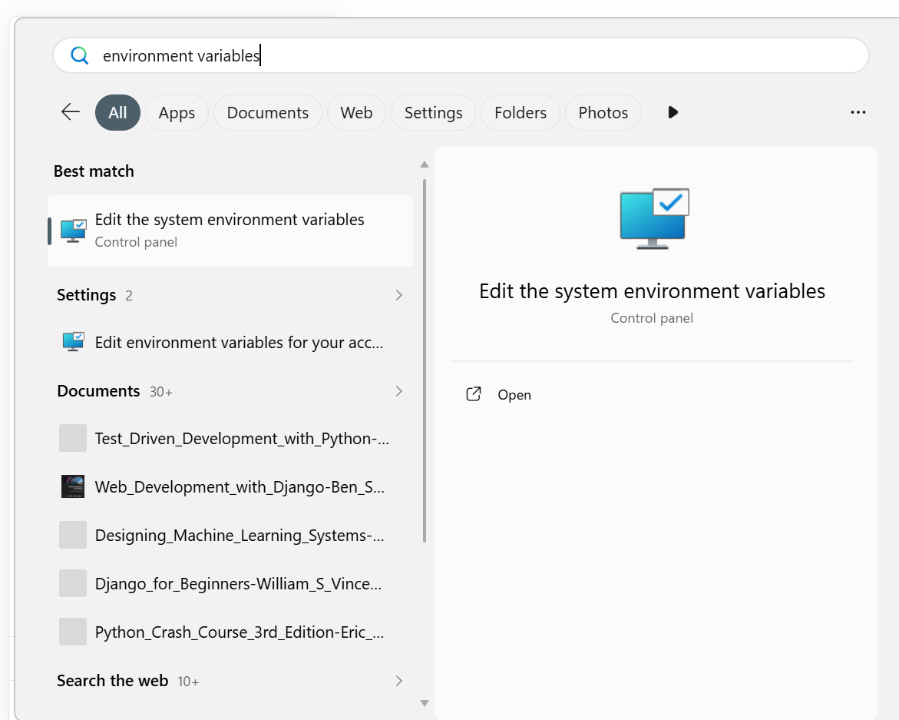
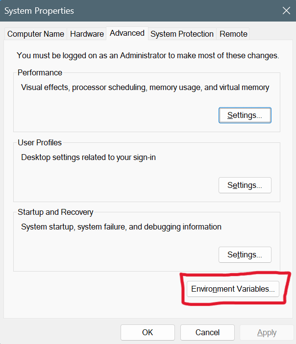
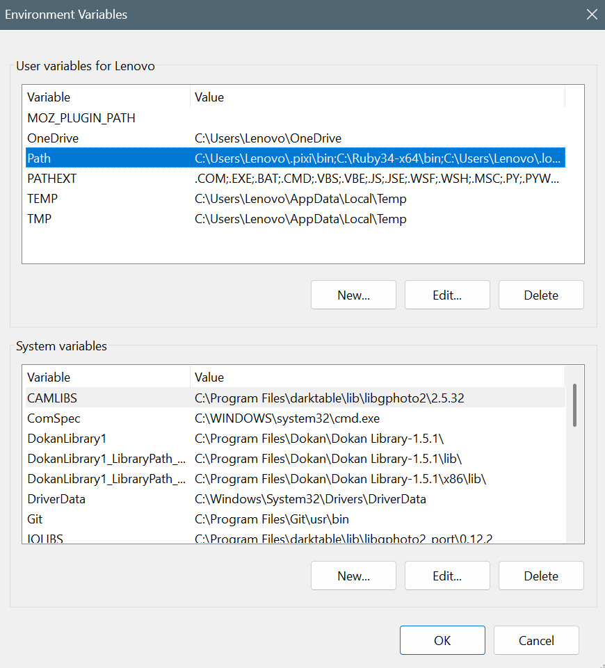
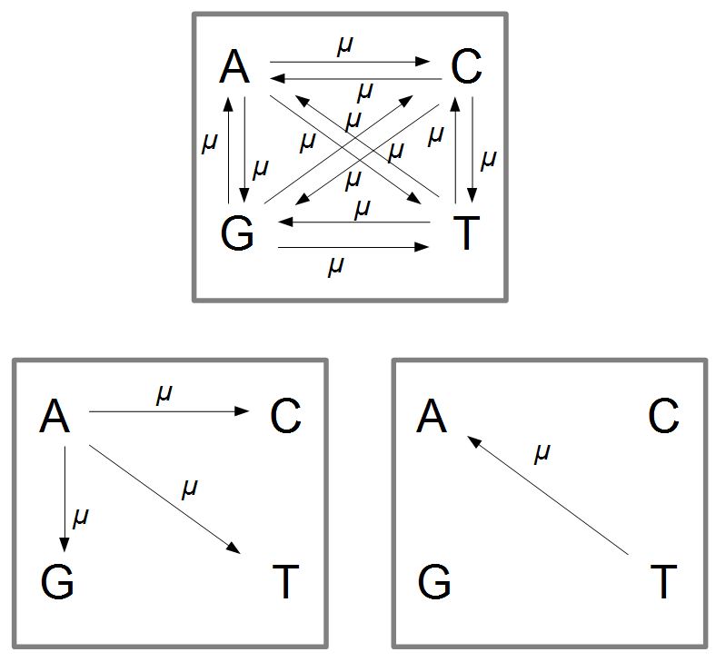
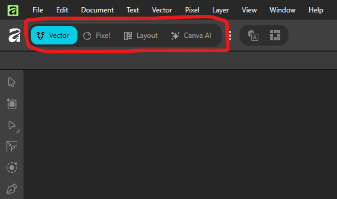

# Phần 3 — Phương pháp Maximum Likelihood & Bayesian Inference

**Trình bày:** Lê Từ Hoàng Linh & Ninh Thị Hòa

Phần này gồm hai mảng: (1) lý thuyết về mô hình thay thế nucleotide và cách
phần mềm chọn mô hình phù hợp, và (2) thực hành dựng cây bằng dòng lệnh với
**IQ-TREE** (Maximum Likelihood) và **MrBayes** (Bayesian Inference).

---

## I. Mô hình tiến hóa

### Vì sao cần một "mô hình" cho việc này?

Hãy tưởng tượng bạn photocopy một trang giấy, rồi lại photocopy bản
photocopy đó, lặp lại hàng ngàn lần. Mỗi lần sao chép có một xác suất nhỏ
bị lỗi (mờ, lem mực...) khiến một chữ cái biến thành chữ khác. Càng sao
chép nhiều lần (càng "xa" bản gốc), số lỗi tích lũy càng nhiều.

DNA cũng vậy: mỗi lần tế bào sao chép DNA để phân chia, có một xác suất
rất nhỏ một base (A/T/G/C) bị chép nhầm thành base khác — đây gọi là
**đột biến thay thế (substitution)**. Hai loài càng "xa" nhau về mặt tiến
hóa (tách ra từ tổ tiên chung càng lâu) thì trình tự DNA của chúng càng
tích lũy nhiều khác biệt.

**Mô hình tiến hóa (evolutionary model)** đơn giản là một công thức toán
mô tả: *"nếu một nucleotide thay đổi, nó có xu hướng đổi thành nucleotide nào, và với
tốc độ ra sao?"* — để từ đó phần mềm có thể tính ngược lại: nhìn vào số
khác biệt hiện có giữa các trình tự, đoán xem cây phát sinh chủng loại
nào là hợp lý nhất.

### Không phải mọi kiểu thay đổi đều xảy ra như nhau



Bốn base chia thành 2 nhóm hóa học: purine (A, G — cấu trúc hai vòng) và
pyrimidine (C, T — cấu trúc một vòng). Quan sát thực nghiệm cho thấy:

- **Đồng hoán (transition)** — đổi trong cùng nhóm (A↔G hoặc C↔T) —
  xảy ra **thường xuyên hơn**, vì hai base cùng nhóm có hình dạng gần
  giống nhau nên dễ "chép nhầm" từ base này sang base kia.
- **Dị hoán (transversion)** — đổi khác nhóm (A↔C, A↔T, G↔C, G↔T) —
  **hiếm hơn**, vì hai base khác nhóm có hình dạng khác nhau nhiều hơn.

Các mô hình **JC69 → K80 → HKY85 → … → GTR** (đi từ trái sang phải trong
hình) chỉ là các phiên bản ngày càng chi tiết hơn của cùng một ý tưởng:
mô hình sau cho phép nhiều tham số tự do hơn mô hình trước (ví dụ: cho
phép transition và transversion có tốc độ khác nhau, cho phép 4 base có
tỉ lệ khác nhau...). Không có mô hình nào "đúng tuyệt đối" — mục tiêu là
chọn mô hình đơn giản nhất nhưng vẫn mô tả tốt dữ liệu thật của mình (xem
phần ModelFinder bên dưới).

Ngoài *loại* thay thế (A→G hay A→C...), tên một mô hình đôi khi còn có
thêm ký hiệu `+G` hoặc `+I` — mô tả việc tốc độ thay đổi không đều giữa
các vị trí trên trình tự. Không cần lo phải tự tính hai tham số này:
ModelFinder sẽ tự động thử và chọn giúp, và phần thực hành ở Mục III sẽ
giải thích cụ thể hai ký hiệu này nghĩa là gì ngay khi bạn nhìn thấy
chúng xuất hiện trong kết quả thật của mình.

### Tóm lại: một mô hình tiến hóa cần trả lời 3 câu hỏi

1. **Thay đổi như thế nào?** (mô hình biến đổi / substitution model — ví
   dụ JC69, HKY85, GTR ở trên).
2. **Thay đổi có đều giữa các vị trí không?** (`+G`, `+I` — chi tiết ở
   Mục III, ngay sau khi chạy IQ-TREE).
3. **Thay đổi có đều theo thời gian không?** (đồng hồ phân tử — chỉ cần
   quan tâm nếu muốn ước tính niên đại của cây, không bắt buộc cho một
   cây ML/Bayes thông thường).

### Vậy làm sao biết nên dùng mô hình nào?

Tin vui: bạn **không cần tự chọn bằng tay**. Có tới hàng chục mô hình
biến đổi khác nhau, và phần mềm **ModelFinder** (Kalyaanamoorthy et al.,
2017) — được tích hợp sẵn trong **IQ-TREE** — sẽ tự động thử qua các mô
hình này trên chính bộ dữ liệu của bạn, rồi chọn ra mô hình "vừa đủ": mô
tả dữ liệu tốt mà không phức tạp thừa thãi.



Đây chính xác là bước đầu tiên khi bạn gõ lệnh chạy IQ-TREE ở phần thực
hành bên dưới — bạn sẽ không cần gõ tên một mô hình cụ thể nào, chỉ cần
báo cho IQ-TREE biết "hãy tự tìm mô hình tốt nhất giúp tôi".

---

## II. Làm quen với Terminal (PowerShell) trên Windows

IQ-TREE và MrBayes đều chạy từ dòng lệnh (command line), không có giao
diện đồ họa như ChromasPro hay MEGA. Trên Windows, dòng lệnh mặc định là
**PowerShell**.

### Cài đặt Terminal (Đầu cuối)

Windows 11 đã có sẵn ứng dụng **Windows Terminal** ("Đầu cuối" trong bản
tiếng Việt) — đây là cửa sổ dòng lệnh hiện đại, hỗ trợ nhiều tab và hiển
thị tiếng Việt tốt hơn cửa sổ PowerShell cũ.

!!! note "Windows 10 cần tải Terminal riêng"
    Nếu máy chạy Windows 10, ứng dụng **Terminal** (Đầu cuối) thường
    **chưa có sẵn** — cần tải miễn phí từ **Microsoft Store** (tìm
    "Terminal" hoặc "Windows Terminal"/"Đầu cuối Windows") rồi cài đặt
    trước khi làm theo hướng dẫn dưới đây. Nếu không cài, bạn vẫn có thể
    dùng cửa sổ **Windows PowerShell** có sẵn, chỉ là giao diện cũ hơn.

### Mở PowerShell

1. Nhấn `Windows` rồi gõ `Terminal` (hoặc `PowerShell` nếu chưa cài
   Terminal) → chọn **Windows PowerShell**.
2. Hoặc: giữ `Shift` + chuột phải vào khoảng trống trong một thư mục trên
   File Explorer → chọn **Open PowerShell window here** (hoặc **Open in
   Terminal**, tùy phiên bản Windows) — cách này mở PowerShell ngay tại
   thư mục đó, khỏi phải `cd` thủ công.

### Các lệnh cơ bản cần biết

| Việc cần làm | Lệnh PowerShell | Ghi chú |
|---|---|---|
| Xem đang ở thư mục nào | `pwd` | viết tắt của Print Working Directory |
| Liệt kê file trong thư mục | `ls` (hoặc `dir`) | `ls` là alias của `Get-ChildItem` |
| Di chuyển vào thư mục con | `cd ten_thu_muc` | dùng `cd ..` để lùi ra thư mục cha |
| Di chuyển đến đường dẫn cụ thể | `cd "C:\Users\Ten\Documents\workshop"` | **để trong ngoặc kép nếu đường dẫn có khoảng trắng** |
| Tạo thư mục mới | `mkdir ten_thu_muc` | |
| Xem nội dung một file text | `cat ten_file.txt` | hữu ích để xem nhanh file `.fasta`/`.nex` |
| Xem N dòng đầu của file (giống `head` trên Linux) | `Get-Content ten_file.txt -TotalCount 10` | có thể viết gọn hơn: `gc ten_file.txt -TotalCount 10`; muốn xem N dòng cuối (giống `tail`) thì thêm `-Tail 10` |
| Chạy một chương trình trong thư mục hiện tại | `.\ten_chuong_trinh.exe` | bắt buộc phải có `.\` ở đầu |

!!! warning "Lỗi thường gặp: đường dẫn có khoảng trắng hoặc dấu tiếng Việt"
    Tên thư mục như `Huong_dan_chay_cay` hay có dấu cách/dấu tiếng Việt sẽ
    khiến lệnh bị lỗi nếu không để trong ngoặc kép. Luôn bọc đường dẫn
    trong `"..."` khi gõ lệnh `cd` hoặc khi truyền tên file cho IQ-TREE/
    MrBayes. Tốt nhất: đặt thư mục làm việc ở một đường dẫn ngắn, không
    dấu, không khoảng trắng (ví dụ `C:\workshop\`) để tránh rắc rối.

### Dùng phím Tab để gõ lệnh nhanh hơn

Nhấn `Tab` khi đang gõ dở tên file, tên thư mục, hoặc tên lệnh để PowerShell
tự hoàn thành nốt phần còn lại — đỡ phải gõ hết đường dẫn dài hay lo gõ sai
tên file `.fasta`/`.nex`. Nhấn `Tab` nhiều lần liên tiếp sẽ lần lượt duyệt
qua từng phương án khớp (khác với Linux/bash vốn hiện luôn cả danh sách,
nhưng vẫn tiết kiệm gõ phím rất nhiều).

---

## III. Xây dựng cây bằng IQ-TREE (Maximum Likelihood)

### Cài đặt IQ-TREE và MrBayes

Cả hai phần mềm đều **không cần "cài đặt" theo kiểu click Next-Next-Finish**
như ChromasPro hay MEGA — chỉ cần tải một file nén về, giải nén ra một thư
mục, rồi (ở bước sau) báo cho Windows biết thư mục đó ở đâu.

**IQ-TREE**

1. Vào trang tải: [iqtree.github.io](https://iqtree.github.io/#download).
2. Chọn bản cho **Windows** (ví dụ `iqtree-3.1.x-Windows.zip`).
3. Giải nén file `.zip` vào một thư mục ngắn gọn, không dấu — ví dụ
   `C:\workshop\iqtree`.
4. File thực thi nằm trong thư mục con `bin\`, tên là **`iqtree3.exe`**.

**MrBayes**

1. Vào trang tải: [nbisweden.github.io/MrBayes](https://nbisweden.github.io/MrBayes/download.html).
2. Chọn bản Windows đã biên dịch sẵn (hiện tại là
   `MrBayes-3.2.7-WIN.zip`).
3. Giải nén vào một thư mục ngắn gọn, không dấu — ví dụ
   `C:\workshop\mrbayes`.
4. Trong mục bin, file thực thi tên là **`mb.3.2.7-win64.exe`**.
5. Đổi tên file thực thị trên thành **`mb.exe`**

!!! note "Bản Windows của MrBayes chạy tuần tự (serial)"
    Bản cài sẵn cho Windows **không đi kèm Beagle/MPI** — nghĩa là chỉ
    chạy trên một luồng CPU, không tăng tốc bằng card đồ họa hay chạy
    song song nhiều máy. Với bộ dữ liệu nhỏ của buổi thực hành (12–16
    taxa, một gen), tốc độ này vẫn đủ nhanh để chạy xong trong một buổi
    học. Nếu sau này cần phân tích dữ liệu lớn hơn nhiều, có thể cân nhắc
    cài qua Homebrew trên WSL/macOS/Linux để có bản MPI.

!!! tip "Không nhất thiết phải để đúng đường dẫn ví dụ ở trên"
    Đường dẫn `C:\workshop\iqtree` và `C:\workshop\mrbayes` chỉ là ví dụ.
    Bạn có thể đặt ở bất kỳ đâu, miễn là **đường dẫn ngắn, không dấu,
    không khoảng trắng** (xem lại cảnh báo ở mục "Các lệnh cơ bản" bên
    trên) — và nhớ chính xác đường dẫn đó để dùng ở bước tiếp theo.

Sau khi giải nén xong cả hai chương trình, bước tiếp theo là thêm hai
thư mục `bin`/thư mục chứa file `.exe` này vào biến môi trường Path, để
có thể gõ thẳng `iqtree3` hoặc `mb` từ bất kỳ đâu.

### Thêm chương trình vào biến môi trường Path

Để có thể gõ thẳng `iqtree3` hoặc `mb` từ bất kỳ thư mục nào (thay vì gõ
đường dẫn đầy đủ tới file `.exe` mỗi lần), cần thêm thư mục chứa chương
trình vào **biến môi trường Path** (environment variable) của Windows:

1. Nhấn nút hình logo của `Windows`, gõ **"biến môi trường"** (hoặc "environment variables")
   → chọn **Edit the system environment variables** (hoặc **Edit
   environment variables for your account** nếu không có quyền quản trị
   máy).

2. Trong cửa sổ **System Properties**, nhấn nút **Environment Variables...**

3. Ở mục **User variables**, chọn dòng **Path** → **Edit...**

4. Nhấn **New** → dán vào đường dẫn thư mục chứa file `.exe` của IQ-TREE
   hoặc MrBayes, ví dụ `C:\workshop\iqtree-3.1\bin`.
5. Nhấn **OK** ở tất cả các cửa sổ để lưu lại.
6. **Đóng và mở lại** cửa sổ PowerShell/Terminal để biến môi trường mới
   có hiệu lực.

!!! note "Kiểm tra đã cài đặt đúng chưa"
    Mở một cửa sổ PowerShell **mới** rồi gõ `iqtree3 --version` hoặc
    `mb --version` — nếu PowerShell báo lỗi "not recognized", nghĩa là
    thư mục chương trình chưa được thêm đúng vào biến môi trường Path,
    hoặc bạn quên mở lại cửa sổ PowerShell sau khi chỉnh.

### Chuẩn bị

- File input: bản alignment đã xuất từ MEGA ở Phần 2, định dạng FASTA,
  PHYLIP hoặc NEXUS (IQ-TREE đọc được cả ba).
- Đặt file alignment vào một thư mục làm việc riêng, đường dẫn ngắn,
  không dấu (xem cảnh báo ở trên).
- Mở PowerShell tại thư mục đó (Shift + chuột phải → *Open PowerShell
  window here*).

### Lệnh cơ bản: chọn mô hình + dựng cây ML + bootstrap

```powershell
iqtree3 -s alignment.fasta -m MFP -B 1000 -T AUTO --prefix cayML -seed 12345
```

Giải thích từng tùy chọn (option):

| Tùy chọn | Ý nghĩa |
|---|---|
| `-s alignment.fasta` | file alignment đầu vào (**bắt buộc**) |
| `-m MFP` | chạy **ModelFinder Plus**: tự động chọn mô hình thay thế tốt nhất rồi dựng cây bằng mô hình đó |
| `-B 1000` | chạy **ultrafast bootstrap** với 1000 lần lặp (tối thiểu khuyến nghị) |
| `-T AUTO` | để IQ-TREE tự chọn số luồng CPU tối ưu |
| `--prefix cayML` | mọi file kết quả sẽ có tên bắt đầu bằng `cayML.*` thay vì trùng tên file input |
| `-seed 12345` | đặt **hạt giống (seed)** cho bộ sinh số ngẫu nhiên — có thể thay `12345` bằng bất kỳ số nguyên nào bạn thích; nếu bỏ qua, IQ-TREE tự lấy seed từ đồng hồ hệ thống |

!!! note "Máy tính không thực sự \"ngẫu nhiên\" — vì sao cần đặt seed (hạt giống)?"
    Máy tính không tạo ra số ngẫu nhiên "thật" — nó dùng một thuật toán
    tất định (deterministic) gọi là **bộ sinh số giả ngẫu nhiên**
    (pseudo-random number generator), xuất ra một chuỗi số *trông có vẻ*
    ngẫu nhiên nhưng thực chất được tính hoàn toàn từ một giá trị khởi
    đầu duy nhất gọi là **seed**. Cùng một seed → luôn cho ra đúng cùng
    một chuỗi số đó, dù chạy lại bao nhiêu lần, trên máy nào.

    Cả IQ-TREE (khi tìm cây ML, chạy bootstrap) và MrBayes (khi lấy mẫu
    MCMC, xem Mục IV) đều dùng số ngẫu nhiên ở rất nhiều bước. Nếu không
    tự đặt seed, phần mềm sẽ tự lấy seed từ đồng hồ hệ thống — nghĩa là
    mỗi lần chạy lại sẽ cho một kết quả hơi khác (dù không khác biệt về
    mặt thống kê). Tự đặt một seed cụ thể giúp:

    - **Tái lập kết quả (reproducibility)**: chạy lại đúng lệnh, đúng
      seed → ra đúng cùng một cây y hệt lần trước — hữu ích khi cần kiểm
      tra lại kết quả, hoặc khi viết bài báo (một số tạp chí yêu cầu ghi
      rõ seed đã dùng để người đọc có thể tái lập phân tích).
    - **Debug**: nếu gặp lỗi hoặc kết quả bất thường, chạy lại với cùng
      seed để tái hiện chính xác vấn đề.

    Bạn *không* cần đặt seed để có một cây "đúng hơn" — với bộ dữ liệu đủ
    thông tin, các seed khác nhau vẫn hội tụ về cùng một kết quả. Đặt
    seed chỉ để đảm bảo có thể tái lập lại đúng lần chạy đó khi cần.

!!! tip "Chạy lại từ đầu"
    Nếu chạy dở rồi muốn chạy lại toàn bộ (ghi đè kết quả cũ), thêm tùy
    chọn `-redo` vào cuối lệnh (đây là dạng tùy chọn không kèm giá trị —
    chỉ cần có mặt là bật tính năng, nên cũng thường được gọi riêng là
    "flag"). Nếu không, IQ-TREE mặc định sẽ tiếp tục từ
    điểm dừng trước đó nhờ file checkpoint `.ckp.gz`.

### Đọc kết quả

Sau khi chạy xong, IQ-TREE tạo ra nhiều file cùng tiền tố (`cayML.*`):

- **`cayML.iqtree`** — báo cáo chính, đọc được bằng mắt: mô hình được
  chọn, cây dạng văn bản kèm giá trị hỗ trợ, log-likelihood...
- **`cayML.treefile`** — cây ML ở định dạng Newick, dùng để mở bằng MEGA
  (xem bên dưới) hoặc các phần mềm xem cây khác như FigTree/iTOL.
- **`cayML.contree`** — cây đồng thuận (consensus) kèm giá trị hỗ trợ đã
  gán, với độ dài nhánh tối ưu lại trên alignment gốc.
- **`cayML.log`** — nhật ký toàn bộ quá trình chạy.

Trong file `.treefile`, mỗi nhánh sẽ có hai con số dạng `(SH-aLRT/UFBoot)`,
ví dụ `(98.2/99)` — càng cao càng đáng tin (xem lại ngưỡng đọc giá trị hỗ
trợ ở Phần 1).

### Hiểu tên mô hình mà ModelFinder vừa chọn cho bạn

Mở file `cayML.iqtree` (xem lại mục "Đọc kết quả" ở trên), tìm dòng ghi
tên mô hình được ModelFinder chọn — thường có dạng gần giống
`GTR+F+I+G4`. Đây chính là lúc lý thuyết ở Mục I trở nên cụ thể:

!!! note "Vì sao đôi khi thấy thêm `+G` hoặc `+I` phía sau tên mô hình?"
    Không phải vị trí nào trên trình tự cũng đột biến nhanh như nhau. Có
    vị trí gần như "đóng băng" suốt hàng triệu năm (vì đột biến ở đó gây
    hại), có vị trí đổi liên tục.

    - `+G` (gamma, thường kèm số như `G4` = 4 lớp tốc độ) = mô hình có
      thêm tham số mô tả sự khác biệt tốc độ này giữa các vị trí.
    - `+I` (invariant) = mô hình giả định có một tỉ lệ vị trí gần như
      không bao giờ đổi.

    Bạn không cần tự tính hai tham số này — ModelFinder đã tự động thử và
    chọn giúp bạn ngay trong lệnh vừa chạy.

Để hình dung mô hình `GTR+F+I+G4` này phức tạp đến đâu, hãy so sánh với
mô hình **đơn giản nhất có thể tồn tại**:

<div class="grid" markdown>



**JC69** (Jukes & Cantor, 1969) — mô hình đơn giản nhất, thường sẽ *không*
phải là mô hình ModelFinder chọn cho dữ liệu thật của bạn, nhưng là điểm
khởi đầu tốt để hiểu ý tưởng:

- Giả định 4 base A, G, C, T xuất hiện với tỉ lệ **bằng nhau** (mỗi loại
  1/4) — còn `GTR` (mô hình có thể ModelFinder vừa chọn) thì cho phép 4
  base có tỉ lệ khác nhau (đây là ý nghĩa của `+F` trong tên mô hình).
- Giả định **mọi kiểu thay thế đều có cùng một tốc độ** μ duy nhất, không
  phân biệt transition/transversion — còn `GTR` (`nst=6`) cho phép cả 6
  tốc độ thay thế khác nhau.

</div>

Hai mảnh ghép còn lại — **đồng hồ phân tử** và **vị trí codon** — không
ảnh hưởng trực tiếp đến lệnh bạn vừa chạy, nhưng đáng biết khi đọc và
diễn giải kết quả:

!!! note "Đồng hồ phân tử: dùng đột biến để đoán thời gian (không bắt buộc cho hôm nay)"
    Nếu tốc độ đột biến ở một vùng DNA tương đối ổn định theo thời gian,
    ta có thể dùng nó như một chiếc "đồng hồ": càng nhiều khác biệt tích
    lũy giữa hai trình tự, hai dòng tiến hóa đó càng tách nhau lâu rồi —
    khá giống cách các nhà cổ sinh vật học dùng đồng vị phóng xạ để ước
    tính tuổi hóa thạch. Tốc độ "đồng hồ" này không giống nhau ở mọi vùng
    hệ gen (DNA ty thể nhanh hơn khoảng 10 lần so với DNA nhân tế bào —
    Brown et al., 1982), nên chỉ nên so sánh trong **cùng một vùng gen**,
    không so sánh giữa các gen khác nhau. Mục III/IV hôm nay không cần
    ước tính niên đại, nên có thể bỏ qua phần này nếu chỉ muốn dựng cây.

!!! note "Với gen mã hóa protein: không phải vị trí nào trong bộ ba cũng 'bình đẳng'"
    Một bộ ba mã (codon) gồm 3 vị trí, mã hóa cho 1 amino acid. Vị trí
    thứ 3 đổi thoải mái nhất (~70% thay đổi ở đây không làm đổi amino
    acid — đột biến **đồng nghĩa**), trong khi vị trí 1 và 2 gần như mọi
    thay đổi đều làm đổi amino acid nên chịu áp lực chọn lọc mạnh hơn,
    ít biến đổi hơn. Đây là lý do một số phân tích chia alignment thành 3
    "phân vùng" theo vị trí codon, mỗi phân vùng dùng một mô hình/tốc độ
    riêng — nhưng với bộ dữ liệu nhỏ hôm nay, dùng chung một mô hình cho
    cả gen (như lệnh `-m MFP` ở trên) là đủ.

### Mở cây bằng MEGA

Vì cả lớp đã quen giao diện MEGA từ Phần 2, có thể dùng luôn MEGA để xem
cây do IQ-TREE dựng, khỏi cần cài thêm phần mềm:

1. Mở **MEGA** → `File → Open A File/Session...` → chọn `cayML.treefile`.
2. MEGA sẽ tự nhận diện đây là một cây Newick và mở ngay trong **Tree
   Explorer**.
3. Trong Tree Explorer, tick ô hiện giá trị hỗ trợ nhánh (thường ở mục
   **Branch/Options** hoặc biểu tượng hình số trên thanh công cụ) để thấy
   cả hai giá trị SH-aLRT/UFBoot tại mỗi nút.
4. Chọn nhánh chứa nhóm ngoài (outgroup) → nhấp chuột phải → chọn **Place
   Root on Branch** để đặt gốc cây đúng vị trí sinh học.

!!! warning "IQ-TREE luôn xuất cây không gốc (unrooted)"
    IQ-TREE không biết thông tin sinh học về nhóm ngoài, nên luôn vẽ cây
    tại điểm xuất phát là taxon đầu tiên trong alignment. Bạn **phải** tự
    đặt gốc lại bằng outgroup khi mở cây trong MEGA.

---

## IV. Xây dựng cây bằng MrBayes (Bayesian Inference)

### Chuẩn bị file NEXUS

MrBayes cần file dữ liệu ở định dạng **NEXUS** (`.nex`), khác với FASTA
IQ-TREE dùng. Dùng MEGA để mở lại trình tự đã được gióng hàng trước đó và
 xuất alignment ra `.nex`.

Tệp NEXUS đầy đủ gồm khối dữ liệu (`begin data; ... end;`) và một khối
lệnh MrBayes ngay bên dưới (`begin mrbayes; ... end;`).

!!! example "Ví dụ một file NEXUS nhỏ, đầy đủ"
    Đây là toàn bộ nội dung một file `.nex` tối giản với 4 taxon (chỉ để
    minh họa cấu trúc — bộ dữ liệu thật của lớp sẽ có nhiều taxon và
    trình tự dài hơn nhiều):

    ```nexus
    #NEXUS

    begin data;
        dimensions ntax=4 nchar=20;
        format datatype=dna missing=? gap=-;
        matrix
        Loai_A            ATGCTAGCTAGCTTAGGCTA
        Loai_B            ATGCTAGCTAGCTTAGGCTG
        Loai_C            ATGCTTGCTAGCTTAGCCTA
        Loai_ngoai_nhom   ATCCTAGGTAGATTAGGATA
        ;
    end;

    begin mrbayes;
        outgroup Loai_ngoai_nhom;
        lset nst=6 rates=invgamma;
        mcmc ngen=100000 samplefreq=100 nchains=4 nruns=2;
        sump burnin=25;
        sumt burnin=25;
    end;
    ```

    Dòng `#NEXUS` **bắt buộc** phải là dòng đầu tiên của file. Khối
    `data` khai báo số taxon (`ntax`), độ dài trình tự (`nchar`), rồi tới
    bảng trình tự (`matrix`) — mỗi dòng là tên taxon và trình tự, cách
    nhau bằng khoảng trắng, không dấu, không khoảng trắng trong tên
    taxon.

Dán phần sau vào cuối file NEXUS được xuất ra từ MEGA:

```nexus
begin mrbayes;
    lset applyto=(all) NucModel=4by4 Nst=6 Rates=Invgamma NGammaCat=8;
    prset applyto=(all) StateFreqPr=Dirichlet(1,1,1,1);
    set autoclose=no seed=12345 swapseed=12345;
    mcmcp ngen=10000000 printfreq=1000 samplefreq=100 nchain=4 nrun=2 temp=0.2 savebrlens=yes;
    mcmc diagnfreq=3000000;
    sump burnin=25000;
    sumt burnin=25000 contype=allcompat conformat=simple;
end;
```

Giải thích một số lệnh chính:

| Lệnh | Ý nghĩa |
|---|---|
| `outgroup` | chỉ định taxon nào là nhóm ngoài để đặt gốc cây |
| `lset nst=6 rates=invgamma` | mô hình GTR (`nst=6` = 6 tốc độ thay thế khác nhau) kèm `+I+G` (`invgamma`) — tương đương mô hình ModelFinder hay chọn cho dữ liệu ty thể |
| `NucModel=4by4` | xử lý dữ liệu theo kiểu **4 trạng thái** nucleotide chuẩn (A/C/G/T) — khác với kiểu `Codon` nếu muốn phân tích theo bộ ba mã |
| `NGammaCat=8` | số lớp rời rạc dùng để xấp xỉ phân phối gamma của `+G`; 8 là giá trị phổ biến — càng nhiều lớp càng chính xác nhưng càng chậm |
| `prset` | đặt tiên nghiệm (prior) cho các tham số của mô hình |
| `set autoclose=no` | không tự đóng chương trình sau khi hoàn thành các lệnh — để có thể xem lại kết quả/nhập lệnh tiếp trong cùng cửa sổ |
| `seed=12345` | hạt giống (seed) cho bộ sinh số ngẫu nhiên chính, dùng khi lấy mẫu MCMC — cùng lý do cần đặt seed như đã giải thích ở Mục III (xem lại "Máy tính không thực sự 'ngẫu nhiên'") |
| `swapseed=12345` | hạt giống **riêng** cho bước hoán đổi (swap) giữa các chuỗi "nóng"/"lạnh" (`nchain`) — MrBayes dùng hai bộ sinh số ngẫu nhiên độc lập nên cần đặt cả hai nếu muốn tái lập chính xác toàn bộ lượt chạy |
| `mcmcp ngen=...` | **đặt trước** các tham số cho lượt chạy MCMC (không chạy ngay) — dùng khi muốn kiểm tra lại cấu hình trước khi thực sự bắt đầu |
| `mcmc` | **bắt đầu chạy** MCMC bằng các tham số đã đặt ở `mcmcp` (có thể ghi đè/bổ sung thêm tham số ngay trên dòng `mcmc`, ví dụ `diagnfreq` ở đây) |
| `ngen=...` | số **thế hệ** (generations) MCMC sẽ chạy — càng nhiều càng dễ hội tụ nhưng càng lâu |
| `printfreq=1000` | cứ bao nhiêu thế hệ thì in tiến trình (log-likelihood, độ lệch chuẩn tần suất phân tách...) ra màn hình một lần |
| `samplefreq` | cứ bao nhiêu thế hệ thì lấy mẫu một cây/tham số |
| `nchain=4` | số **chuỗi** MCMCMC chạy song song trong mỗi run (1 chuỗi "lạnh" dùng để lấy mẫu + 3 chuỗi "nóng" hỗ trợ khám phá không gian cây, tránh bị kẹt ở một đỉnh likelihood cục bộ) |
| `nrun=2` | chạy 2 lượt độc lập cùng lúc để so sánh hội tụ |
| `temp=0.2` | mức chênh nhiệt độ giữa các chuỗi "nóng" và chuỗi "lạnh" — giá trị nhỏ hơn giúp các chuỗi dễ hoán đổi (swap) cho nhau hơn, hỗ trợ khám phá không gian cây tốt hơn |
| `savebrlens=yes` | lưu lại độ dài nhánh của từng cây được lấy mẫu (cần thiết nếu muốn xem cây đồng thuận với độ dài nhánh) |
| `diagnfreq=3000000` | cứ bao nhiêu thế hệ thì tính lại các chỉ số chẩn đoán hội tụ (độ lệch chuẩn tần suất phân tách giữa các run) một lần |
| `sump` / `sumt` | tóm tắt tham số / tóm tắt cây sau khi bỏ **giai đoạn khởi động** (`burnin`) |
| `contype=allcompat` | kiểu cây đồng thuận: `allcompat` giữ lại **tất cả** các nhóm tương thích → cây đầy đủ, phân giải tối đa, **không** bị gộp (collapse) các nhánh hỗ trợ thấp thành đa phân — khác với mặc định `halfcompat` (chỉ giữ nhóm có hỗ trợ ≥ 50%) |
| `conformat=simple` | xuất file cây đồng thuận (`.con.tre`) ở định dạng Newick/NEXUS **đơn giản** — khác với `figtree` (kèm thêm khối lệnh định dạng riêng cho phần mềm FigTree) |

!!! note "Chọn số thế hệ (ngen) thế nào?"
    Với bộ dữ liệu nhỏ (12–16 taxa, một gen) dùng trong buổi thực hành,
    vài trăm nghìn đến 1 triệu thế hệ thường đã hội tụ trong một buổi
    học. Với dữ liệu lớn hơn hoặc nhiều gen, có thể cần hàng chục triệu
    thế hệ — nên chuẩn bị sẵn một lượt chạy dài hơn đã tính toán trước
    làm phương án dự phòng.

### Chạy MrBayes từ PowerShell

```powershell
mb bo_du_lieu.nex
```

MrBayes sẽ đọc và thực thi khối lệnh `mrbayes` có sẵn trong file `.nex`
rồi tự động bắt đầu chạy MCMC. Ngoài ra bạn cũng có thể mở MrBayes trước
(gõ `mb`) rồi gõ `execute bo_du_lieu.nex` ngay trong giao diện dòng lệnh
của nó.

### Theo dõi hội tụ trong khi chạy

Trong lúc chạy, MrBayes liên tục in ra **độ lệch chuẩn của tần suất phân
tách** (standard deviation of split frequencies) giữa các run — đây là
cách kiểm tra hội tụ nhanh nhất, ngay trong lúc chạy:

!!! tip "Đọc độ lệch chuẩn của tần suất phân tách"
    Giá trị này càng gần 0 càng tốt. Quy ước thường dùng: **dưới 0.01** là
    dấu hiệu tốt cho thấy hai (hay nhiều) run độc lập đang hội tụ về cùng
    một vùng không gian cây. Nếu sau khi chạy xong giá trị này vẫn cao
    (> 0.05), cần chạy thêm thế hệ (tăng `ngen`) trước khi tin vào kết
    quả.

### Đọc kết quả & kiểm tra bằng Tracer

Tải **Tracer** (miễn phí) tại:
[github.com/beast-dev/tracer/releases](https://github.com/beast-dev/tracer/releases/latest){:target="_blank"}
— chọn bản `.zip` cho Windows, `.dmg` cho macOS, hoặc `.tgz` cho Linux.

Sau khi chạy xong, MrBayes tạo ra (với `nruns=2`) các file như:

- `bo_du_lieu.nex.run1.p`, `.run2.p` — giá trị tham số (log-likelihood,
  tốc độ thay thế...) theo từng thế hệ đã lấy mẫu.
- `bo_du_lieu.nex.run1.t`, `.run2.t` — các cây đã lấy mẫu (định dạng
  Newick, có thể mở bằng MEGA hoặc FigTree).
- `bo_du_lieu.nex.con.tre` — cây đồng thuận (consensus) cuối cùng, kèm
  **xác suất hậu nghiệm (PP)** ở mỗi nhánh.

1. Mở **Tracer** → `File → Import Trace File` → chọn cả hai file `.p`.
2. Kiểm tra cột **ESS** (Effective Sample Size) của mỗi tham số — nên
   **trên 200**; nếu thấp hơn, cần chạy thêm thế hệ.
3. Xem biểu đồ vết (trace plot) của `LnL` (log-likelihood) — nếu hình
   dạng giống "bãi cỏ dày" (hairy caterpillar) dao động quanh một giá trị
   ổn định, đó là dấu hiệu chuỗi đã hội tụ; nếu vẫn còn xu hướng tăng/giảm
   rõ rệt, chưa nên tin kết quả.
4. Mở `bo_du_lieu.nex.con.tre` bằng MEGA (`File → Open A File/Session...`,
   giống bước mở cây IQ-TREE ở trên) để xem cây đồng thuận kèm xác suất
   hậu nghiệm tại mỗi nút.

### Đổi `.con.tre` sang Newick thuần túy bằng trang web (khi cần)

File `.con.tre` MrBayes xuất ra thực chất là một cây ở định dạng
**NEXUS** (có khối `translate` gán số thứ tự cho từng taxon), không phải
Newick thuần túy như file `.treefile` của IQ-TREE. MEGA đọc trực tiếp
được file này nên bình thường bạn không cần chuyển đổi gì — nhưng một số
công cụ khác (iTOL, các gói R như `ape`/`phytools`, hoặc một số trình xem
cây trực tuyến khác) chỉ nhận Newick thuần túy. Lúc đó, thay vì cài thêm
phần mềm, có thể dùng một trang web chuyển đổi định dạng miễn phí:

1. Vào trang chuyển đổi định dạng của Phylogeny.fr:
   [phylogeny.lirmm.fr/phylo_cgi/data_converter.cgi](http://phylogeny.lirmm.fr/phylo_cgi/data_converter.cgi){:target="_blank"}.
2. Dán toàn bộ nội dung file `.con.tre` vào ô dữ liệu (hoặc tải file lên
   trực tiếp bằng nút **Upload**) — trang web tự nhận diện đây là một
   cây NEXUS.
3. Ở mục **Output format**, chọn **Newick Tree**.
4. Nhấn nút chuyển đổi → tải về hoặc copy kết quả: một dòng cây Newick
   thuần túy (dạng `(...);`), vẫn giữ đúng tên taxon gốc nhờ trang web tự
   tra khối `translate`.

!!! tip
    Có thể dùng cách này cho bất kỳ cây NEXUS nào cần chuyển sang Newick,
    không chỉ riêng file của MrBayes — kể cả file `.nex`/`.tre` xuất ra
    từ MEGA hay các phần mềm khác.

---

## V. Xuất cây ra PowerPoint/Affinity để hoàn thiện trước khi đăng báo

Cây do MEGA/IQ-TREE/MrBayes vẽ ra rất tốt để **xem và diễn giải**, nhưng
hầu như không đạt yêu cầu trình bày của một hình trên tạp chí khoa học
(font chữ mặc định, tên loài chưa in nghiêng, không có thanh tỉ lệ rõ
ràng, dày đặc nhãn số không cần thiết...). Bước cuối cùng này là đưa cây
vào một phần mềm thiết kế để "làm đẹp" thành hình hoàn chỉnh.

### Vì sao không chụp màn hình?

!!! warning "Đừng chụp màn hình (screenshot) cây để làm hình bài báo"
    Ảnh chụp màn hình là ảnh **raster** (bitmap) — phóng to lên sẽ bị vỡ
    nét, chữ mờ, không đạt độ phân giải tối thiểu tạp chí yêu cầu (thường
    300–600 dpi). Nên **xuất cây ở định dạng vector** (SVG) — dạng file
     này lưu các đường nét và chữ dưới dạng công thức toán
    học, có thể phóng to tùy ý mà không vỡ hình, và quan trọng nhất: vẫn
    **chỉnh sửa được từng chi tiết** (di chuyển nhãn, đổi màu một nhánh...)
    khi mở trong PowerPoint hay Affinity.

### Bước 1 — Xuất cây dạng SVG từ MEGA

1. Trong **Tree Explorer** (nơi bạn đang xem file newick từ cây IQ-TREE/MrBayes), vào
   menu `Image` → **Save as SVG File...** (hoặc tùy phiên bản MEGA có thể
   ghi là **Export Current View to SVG**).
2. Lưu file `.svg` — đây chính là bản vector, giữ nguyên mọi đường nét và
   chữ ở dạng có thể chỉnh sửa được.

### Bước 2 — Chỉnh sửa trong PowerPoint

1. Insert file SVG vào một slide: `Insert → Pictures → This Device...`
   (PowerPoint bản mới hỗ trợ chèn SVG trực tiếp).
2. Nhấp phải vào hình → **Convert to Shape** → xác nhận. Lặp lại
   **Ungroup** một hoặc hai lần nữa cho đến khi mỗi đường nhánh, mỗi nhãn
   taxon trở thành một đối tượng có thể chọn và chỉnh riêng lẻ.
3. Việc thường làm ở bước này:
      - In nghiêng tên loài (`Genus species` — Newick không tự động lưu
        định dạng chữ nghiêng, phải tự bôi đen và nhấn `Ctrl+I`).
      - Xóa bớt nhãn/số không cần thiết (ví dụ chỉ giữ giá trị hỗ trợ ở
        những nhánh quan trọng).
      - Tô màu/đóng khung một nhánh đơn ngành (clade) đang muốn nhấn
        mạnh.
      - Thêm chú thích, mũi tên, hoặc ảnh mẫu vật bên cạnh cây.
      - Căn chỉnh lại thanh tỉ lệ (scale bar) cho rõ ràng, có ghi đơn vị
        (ví dụ "0.02 substitutions/site").
4. Sau khi xong, chọn lại toàn bộ các đối tượng → nhấp phải → **Group**,
   rồi `File → Save As` → chọn định dạng ảnh (`.png`/`.tiff`) hoặc giữ
   `.pptx` để chỉnh sửa tiếp sau này.

### Bước 3 — Dùng Affinity khi cần độ chính xác cao hơn

PowerPoint đủ dùng cho hầu hết trường hợp, nhưng nếu tạp chí yêu cầu kích
thước hình chính xác theo cm/inch, hệ màu CMYK, hoặc độ phân giải xuất
file cao hơn, **Affinity** (phần mềm chỉnh sửa ảnh và vẽ vector, miễn phí
từ Canva) phù hợp hơn. Tải tại:
[affinity.studio/download](https://www.affinity.studio/download){:target="_blank"}
(cần đăng nhập bằng tài khoản Canva, miễn phí, để tải và sử dụng):

1. Mở file `.svg` xuất từ MEGA bằng Affinity, chuyển sang chế độ
   **Vector** (Vector persona) — đây là chế độ dùng để chỉnh chính cây
   phát sinh chủng loại (đường nét, chữ, hình khối).
2. Affinity tự tách các đối tượng thành từng lớp (layer) riêng — chọn
   từng nhánh/nhãn để chỉnh y như bước 2 ở trên (in nghiêng, đổi màu, xóa
   nhãn thừa...).
3. Tạo **artboard** đúng kích thước tạp chí yêu cầu (ví dụ cột đơn ~8.3 cm
   hoặc cột đôi ~17.3 cm — xem mục "Instructions for Authors" của tạp chí
   định gửi bài).
4. `File → Export` → chọn định dạng và độ phân giải theo đúng yêu cầu
   (thường TIFF hoặc PNG, 300–600 dpi cho hình raster; hoặc giữ nguyên SVG
   vector nếu tạp chí chấp nhận).

!!! note "Ba chế độ trong Affinity"
    Affinity hiện là **một phần mềm duy nhất** với ba chế độ (persona) có
    thể chuyển qua lại ngay trong cùng một file, thay vì ba ứng dụng
    riêng như trước:

    - **Vector** — dùng để chỉnh chính cây phát sinh chủng loại (đường
      nét, chữ, hình khối); đây là chế độ chính cho công việc trong mục
      này.
    - **Ảnh** (Pixel/Image) — chế độ raster (giống Photoshop), dùng khi
      cần chỉnh ảnh chụp mẫu vật thật (ảnh động vật/thực vật) sẽ ghép
      cùng hình cây, ví dụ cắt nền, chỉnh sáng/tương phản.
    - **Bố cục** (Layout) — dùng khi cần dàn trang nhiều hình/nhiều
      phần (ví dụ ghép hình cây với bảng số liệu, chú thích) thành một
      trang hoàn chỉnh trước khi xuất, tương tự InDesign.
    <br>
    

!!! tip "Danh sách kiểm tra trước khi gửi hình cho tạp chí"
    - [x] Tên loài (genus, species) đã in nghiêng.
    - [x] Font chữ đồng nhất, đủ lớn để đọc được khi hình bị thu nhỏ.
    - [x] Có thanh tỉ lệ (scale bar) kèm đơn vị.
    - [x] Nhóm ngoài (outgroup) được đánh dấu/ghi chú rõ ràng.
    - [x] Chỉ giữ giá trị hỗ trợ cần thiết, không để dày đặc gây rối mắt.
    - [x] Đã kiểm tra lại kích thước & định dạng file theo đúng yêu cầu
      "Instructions for Authors" của tạp chí định gửi.

---

## Tổng kết Phần 3

```
Chọn mô hình (ModelFinder) → IQ-TREE: cây ML + SH-aLRT + UFBoot
                            → MrBayes: MCMC + kiểm tra hội tụ → cây Bayes + PP
                            → So sánh cây ML và cây Bayes (Phần 6)
                            → Xuất vector (MEGA) → hoàn thiện bằng
                              PowerPoint/Affinity → hình cho bài báo
```

Ở đây bạn đã có cả một cây Maximum Likelihood (kèm hai loại giá trị hỗ
trợ) và một cây Bayesian (kèm xác suất hậu nghiệm) từ cùng một bộ dữ liệu
alignment. Bước tiếp theo là so sánh song song hai cây này, diễn giải
đúng ý nghĩa của từng loại giá trị hỗ trợ, và khi đã chọn được cây cuối
cùng muốn công bố, dùng PowerPoint hoặc Affinity để hoàn thiện nó thành
một hình đạt chuẩn đăng tạp chí.
